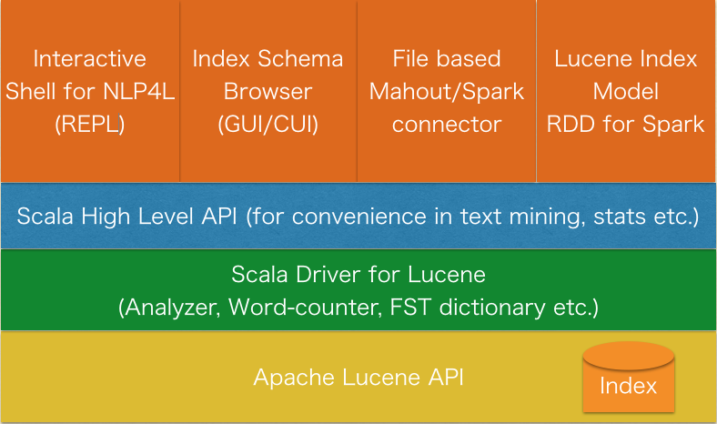

# What's NLP4L ?

NLP4L is a natural language processing tool for [Apache Lucene](https://lucene.apache.org/core/) written in Scala. The main purpose of NLP4L is to use the NLP technology to improve Lucene users' search experience. Lucene/Solr, for example, already provides its users with auto-complete and suggestion functions for search keywords. Using NLP technology, NLP4L development members may be able to present better keywords. In addition, NLP4L provides functions to collaborate with existing machine learning tools, including one to directly create document vector from a Lucene index and write it to a LIBSVM format file.

As NLP4L processes document data registered in the Lucene index, you can directly access a word database normalized by powerful Lucene Analyzer and use handy search functions. Being written in Scala, NLP4L excels at trying ad hoc interactive processing as well. 

Refer to the following documents for more details.

- Tutorial [Japanese](http://nlp4l.github.io/tutorial_ja.html)/[English](http://nlp4l.github.io/tutorial.html) (to be available later)
- [API Docs](http://nlp4l.github.io/api/index.html)

# Target Users 

- [Apache Lucene](https://lucene.apache.org/core/), including Lucene/Solr/Elasticsearch, users.
- Users who want to try out various document vectors to input data to existing machine learning tools including [Apache Spark](https://spark.apache.org/) and [Apache Mahout](http://mahout.apache.org/).
- Other NLP tool users and Scala programers.

# Architecture



# Basic Usage

## Building NLP4L 

```shell
$ sbt pack
```

## Starting Interactive Shell 

```shell
$ target/pack/bin/nlp4l
Welcome to NLP4L!
Type in expressions to have them evaluated.
Type :help for more information
Type :? for information about NLP4L utilities

nlp4l> 
```

## Using Lucene index browser

### Help

```shell
nlp4l> :?
```

### Help with detailed information

```shell
nlp4l> :? open
-- method signature --
def open(idxDir: String): RawReader

-- description --
Open Lucene index in the directory. If an index already opened, that is closed before the new index will be opened.

-- arguments --
idxDir       Lucene index directory

-- return value --
Return : index reader

-- usage --
nlp4l> open("/tmp/myindex")
```

### Show the index status

```shell
nlp4l> open("/tmp/index-ldcc")
Index /tmp/index-ldcc was opened.
res4: org.nlp4l.core.RawReader = IndexReader(path='/tmp/index-ldcc',closed=false)

nlp4l> status

========================================
Index Path       : /tmp/index-ldcc
Closed           : false
Num of Fields    : 5
Num of Docs      : 7367
Num of Max Docs  : 7367
Has Deletions    : false
========================================
        
Fields Info:
========================================
  # | Name  | Num Terms 
----------------------------------------
  0 | body  |      64543
  1 | url   |       7367
  2 | date  |       6753
  3 | title |      14205
  4 | cat   |          9
========================================
```

### Browse the inverted index (browseTerms)

```shell
nlp4l> browseTerms("title")
Browse terms for field 'title', page size 20
Type "nextTerms(skip)" or "nt" to browse next terms.
Type "prevTerms(skip)" or "pt" to browse prev terms.
Type "topTerms(n)" to find top n frequent terms.

// nt command for next terms
nlp4l> nt
Indexed terms for field 'title'
0 (DF=152, Total TF=176)
000 (DF=13, Total TF=13)
003 (DF=3, Total TF=3)
0048 (DF=1, Total TF=1)
007 (DF=8, Total TF=8)
...

// pt command for previous terms
nlp4l> pt
Indexed terms for field 'title'
chat (DF=1, Total TF=1)
check (DF=2, Total TF=2)
chochokure (DF=1, Total TF=1)
christian (DF=1, Total TF=1)
...
```

### Browse the inverted index (browseTermDocss)

```shell
nlp4l> browseTermDocs("title", "iphone")
Browse docs for term 'iphone' in field 'title', page size 20
Type "nextDocs(skip)" or "nd" to browse next terms.
Type "prevDocs(skip)" or "pd" to browse prev terms.

// nd command for the next documents
nlp4l> nd
Documents for term 'iphone' in field 'title'
Doc(id=49, freq=1, positions=List(pos=5))
Doc(id=270, freq=1, positions=List(pos=0))
Doc(id=648, freq=1, positions=List(pos=0))
Doc(id=653, freq=1, positions=List(pos=2))
Doc(id=778, freq=1, positions=List(pos=2))
Doc(id=780, freq=2, positions=List(pos=0, pos=15))
...

// pd command for the previous documents
nlp4l> pd
Documents for term 'iphone' in field 'title'
Doc(id=1173, freq=1, positions=List(pos=1))
Doc(id=1176, freq=1, positions=List(pos=0))
Doc(id=1180, freq=1, positions=List(pos=2))
Doc(id=1195, freq=1, positions=List(pos=5))
Doc(id=1200, freq=1, positions=List(pos=11))
Doc(id=1203, freq=1, positions=List(pos=5))
...
```

### Show the contents of a document

```shell
nlp4l> showDoc(1195)
Doc #1195
(Field) cat: [it-life-hack]
(Field) url: [http://news.livedoor.com/article/detail/6608703/]
(Field) title: [GoogleドライブのファイルをiPhoneからダイレクトに編集する【知っ得！虎の巻】]
...
```

### Close the index

```shell
nlp4l> close
Index /tmp/index-ldcc was closed.
```

## Testing NLP4L

```shell
$ sbt test
```

# Known Limitations

With unoptimized index, you may not be able to get an accurate word count.
