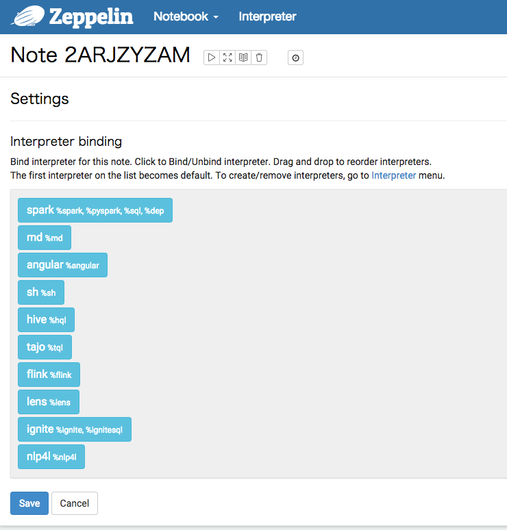
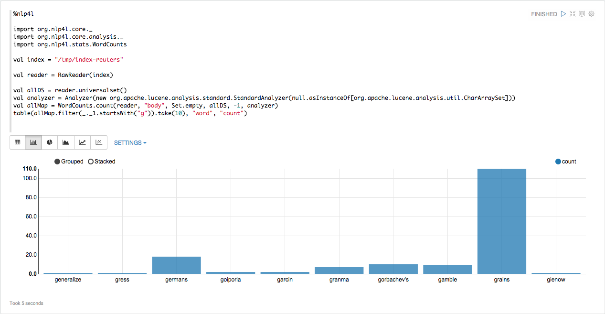
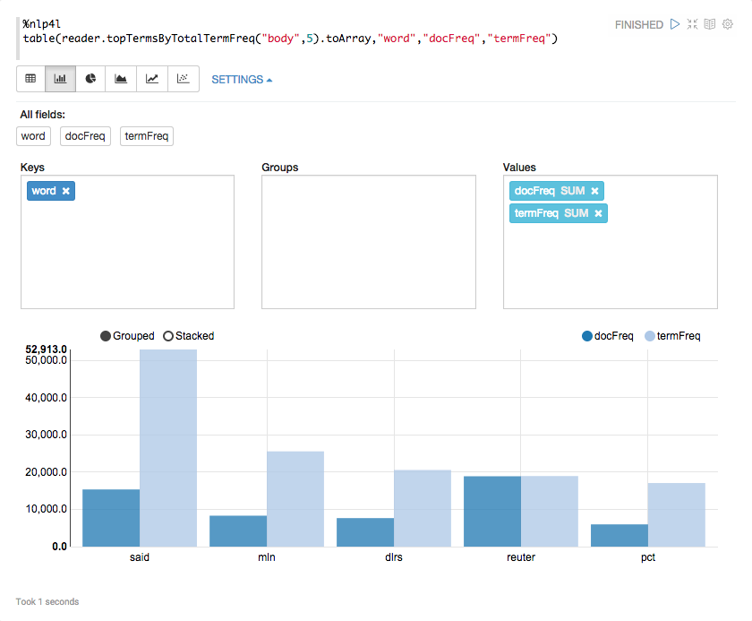
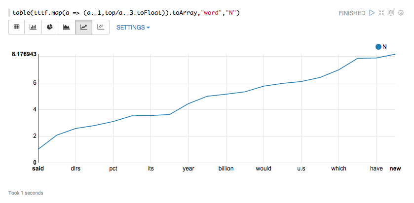

### Contents

* [Let's Get Started!](#gettingStarted)
* [Installing NLP4L](#install)
* [Obtaining Practice Corpus](#getCorpora)
    * [NLP4L Interactive Shell](#getCorpora_repl)
    * [What is Index?](#getCorpora_index)
    * [Obtaining livedoor News Corpus and Creating Index](#getCorpora_ldcc)
    * [Creating Index with Data in the Companion CD-ROM that Accompanies the book "言語研究のための統計入門" (ISBN978-4-87424-498-2)](#getCorpora_book)
    * [Obtaining Brown Corpus and Creating an Index](#getCorpora_brown)
    * [Obtaining Reuters Corpus and Creating an Index](#getCorpora_reuters)
    * [Obtaining Wikipedia Data and Creating an Index](#getCorpora_wiki)
    * [NLP4L Schema](#getCorpora_schema)
    * [Importing a CSV File](#getCorpora_csv)
* [Using as NLP Tool](#useNLP)
    * [Counting the Number of Words](#useNLP_wordcounts)
* [Using Index Browser](#indexBrowser)
* [To Solr Users](#dearSolrUsers)
* [To Elasticsearch Users](#dearESUsers)
* [Working with Mahout](#useWithMahout)
* [Working with Spark](#useWithSpark)
* [Using Lucene](#useLucene)
* [Using NLP4L from Apache Zeppelin](#withZeppelin)
    * [Installing Apache Zeppelin](#withZeppelin_install)
    * [Deploying libraries of NLP4L to Apache Zeppelin](#withZeppelin_deploy)
    * [Starting Apache Zeppelin](#withZeppelin_start)
    * [Creating a note and saving NLP4LInterpreter](#withZeppelin_save)
    * [Executing commands or programs of NLP4L](#withZeppelin_exec)
    * [Visualising word counts](#withZeppelin_visualize)
    * [Visualizing Zipf's Law](#withZeppelin_zipfslaw)
* [Developing and Executing NLP4L Programs](#develop)
* [Attribution](#tm)

# Let's Get Started!{#gettingStarted}
# Installing NLP4L{#install}
# Obtaining Practice Corpus{#getCorpora}

Before start analyzing your own text file using NLP4L, you are encouraged to use a practice corpus to check the action. Analyzing your own text file straight away may results in longer time to successfully complete the process or wondering about the ways to evaluate the analysis.

You will be able to actually try the followings and understand them easier if you first create an index using a practice corpus explained here.

Note that the corpora introduced here, except for the livedoor news corpus and wikipedia, are for research purpose only. Please be very careful using them.

## NLP4L Interactive Shell{#getCorpora_repl}

NLP4L has an interactive shell that comes in handy for running commands and Scala codes. Start an interactive shell (REPL) as follows when NLP4L has been built.

```shell
$ ./target/pack/bin/nlp4l
Welcome to NLP4L!
Type in expressions to have them evaluated.
Type :help for more information
Type :? for information about NLP4L utilities
nlp4l>
```

## What is Index?{#getCorpora_index}

NLP4L saves text files, which are put into the natural language process, in the inverted index for Lucene. An inverted index is a file structure that is organized so that you can use a word as the key to obtain a list of document numbers. We will refer to the inverted index simply as "index" in this document.

You can use an NLP4L function to create an index from a text file or otherwise make an existing index created by Apache Solr or Elasticsearch the target of NLP4L process. When you do the latter, however, pay good attention to the version of Lucene that Solr and Elasticsearch are using. Index created using the version that is too old may not sometimes be read by NLP4L Lucene library.

The followings will discuss how to obtain a practice corpus (text file) and create an index from scratch.

## Obtaining livedoor News Corpus and Creating Index{#getCorpora_ldcc}

Execute the following to download and expand a livedoor news corpus from the RONDHUIT site.

```shell
$ mkdir -p ${nlp4l}/corpora/ldcc
$ cd ${nlp4l}/corpora/ldcc
$ wget http://www.rondhuit.com/ download /ldcc-20140209.tar.gz
$ tar xvzf ldcc-20140209.tar.gz
```

Windows users: Please adjust to your own environment as appropriate to execute the scripts.

[Note] NLP4L interactive shell provides commands (Supports Unix-like operating systems only) to execute the above procedures.

```shell
nlp4l> downloadLdcc
Successfully downloaded ldcc-20140209.tar.gz
Try to execute system command: tar xzf /Users/tomoko/repo/NLP4L/corpora/ldcc/ldcc-20140209.tar.gz -C /Users/tomoko/repo/NLP4L/corpora/ldcc
Success.
```

Expanding livedoor news corpus will create subdirectories with the following category names directly under the text directory

```shell
$ ls -l text
total 16
-rw-r--r-- 1 koji staff 223 9 16 2012 CHANGES.txt
-rw-r--r-- 1 koji staff 2182 9 13 2012 README.txt
drwxr-xr-x 873 koji staff 29682 2 9 2014 dokujo-tsushin
drwxr-xr-x 873 koji staff 29682 2 9 2014 it-life-hack
drwxr-xr-x 867 koji staff 29478 2 9 2014 kaden-channel
drwxr-xr-x 514 koji staff 17476 2 9 2014 livedoor-homme
drwxr-xr-x 873 koji staff 29682 2 9 2014 movie-enter
drwxr-xr-x 845 koji staff 28730 2 9 2014 peachy
drwxr-xr-x 873 koji staff 29682 2 9 2014 smax
drwxr-xr-x 903 koji staff 30702 2 9 2014 sports-watch
drwxr-xr-x 773 koji staff 26282 2 9 2014 topic-news
```

In addition, each subdirectory has files where one file contains one article. An article file looks like as follows.

```shell
$ head -n 5 text/sports-watch/sports-watch-6577722.txt
http://news.livedoor.com/article/detail/6577722/
2012-05-21T09:00:00+0900
渦中の香川真司にインタビュー、「ズバリ次のチーム、話を伺いたい」
20日放送、NHK「サンデースポーツ」では、山岸舞彩キャスターが日本代表・香川真司に行ったインタビューの模様を放送した。

```

The first line is the URL, the second line is the date, the third line is the title, and the fourth and the followings are the body of livedoor news article respectively.

Next, we will execute the examples/index_ldcc.scala program from the nlp4l command prompt to add livedoor news corpus to the Lucene index. To do so, start nlp4l as follows and use the load command to execute the examples/index_ldcc.scala program.

```shell
$ bin/nlp4l
nlp4l> :load examples/index_ldcc.scala
```

At the beginning of this program, Lucene index directory created in the manner described later is defined as follows.

```scala
val index = "/tmp/index-ldcc"
```

If this directory does not fit well (such as when you are using Windows), change it to point to another place and use the load command to execute the program again.

The Lucene index directory will look like as follows when this program is executed.

```shell
$ ls -l /tmp/index-ldcc
total 67432
-rw-r--r-- 1 koji wheel 16359884 2 24 13:40 _1.fdt
-rw-r--r-- 1 koji wheel 4963 2 24 13:40 _1.fdx
-rw-r--r-- 1 koji wheel 520 2 24 13:40 _1.fnm
-rw-r--r-- 1 koji wheel 7505 2 24 13:40 _1.nvd
-rw-r--r-- 1 koji wheel 147 2 24 13:40 _1.nvm
-rw-r--r-- 1 koji wheel 453 2 24 13:40 _1.si
-rw-r--r-- 1 koji wheel 11319391 2 24 13:40 _1.tvd
-rw-r--r-- 1 koji wheel 5636 2 24 13:40 _1.tvx
-rw-r--r-- 1 koji wheel 2169767 2 24 13:40 _1_Lucene50_0.doc
-rw-r--r-- 1 koji wheel 3322315 2 24 13:40 _1_Lucene50_0.pos
-rw-r--r-- 1 koji wheel 1272515 2 24 13:40 _1_Lucene50_0.tim
-rw-r--r-- 1 koji wheel 26263 2 24 13:40 _1_Lucene50_0.tip
-rw-r--r-- 1 koji wheel 136 2 24 13:40 segments_1
-rw-r--r-- 1 koji wheel 0 2 24 13:40 write.lock
```

## Creating Index with Data in the Companion CD-ROM that Accompanies the book "言語研究のための統計入門" (ISBN978-4-87424-498-2){#getCorpora_book}

If you have the following book [1], you can use the data in CD-ROM that accompanies this book as your corpus. Otherwise, please proceed to the next section.

```shell
[1] 言語研究のための統計入門
石川慎一郎、前田忠彦、山崎誠 編
くろしお出版
ISBN978-4-87424-498-2
```

Copy folders under "INDIVIDUAL WRITERS" (excluding "INDIVIDUAL WRITERS") and folders under "PLAIN"(including "PLAIN") in the data of CD-ROM that accompanies the book "言語研究のための統計入門" to corpora/CEEAUS. When copying is complete, check to see if it looks like the followings.

```shell
# Creating a Directory
$ mkdir -p corpora/CEEAUS

# Copy the CD-ROM

# Confirm the Copied Contents
$ find corpora/CEEAUS -type d
corpora/CEEAUS
corpora/CEEAUS/CEECUS
corpora/CEEAUS/CEEJUS
corpora/CEEAUS/CEENAS
corpora/CEEAUS/CJEJUS
corpora/CEEAUS/PLAIN
```

The CEEAUS corpus is characterized by its highly controlled writing condition. There are 2 articles with respective themes; one is about "Part-time jobs of college students" (file names with "ptj") and the other is "Complete nonsmoking in restaurants" (file names with "smk"). Subdirectories under CEEAUS are divided as follows.

|Subdirectories|Contents|
|:----:|:----------------------------|
|CEEJUS|日本人大学生による英作文770本(770 English essays by Japanese college students)|
|CEECUS|中国人大学生による英作文92本(92 English essays by Chinese college students)|
|CEENAS|成人 English 母語話者による英作文92本(92 English essays by adult native speakers)|
|CJEJUS|日本人大学生による日本語作文50本(50 Japanese essays by Japanese college students)|
|PLAIN|上記すべてを含む(All of the above)|

Now we will create a Lucene index from the CEEAUS corpus. First, use corpora other than PLAIN to create a Lucene index.

```shell
$ bin/nlp4l
nlp4l> :load examples/index_ceeaus.scala
```

Next, use PLAIN to create a Lucene index.

```shell
$ bin/nlp4l
nlp4l> :load examples/index_ceeaus_all.scala
```

As you can see by looking at the beginning of each program, each Lucene indexes are created in /tmp/index-ceeaus and /tmp/index-ceeaus-all respectively. As in the previous example, you need to rewrite the lines and execute the program again if you want to create them in other directories.

## Obtaining Brown Corpus and Creating an Index{#getCorpora_brown}

Download the Brown corpus to corpora/brown and expand it as follows.

```shell
$ mkdir ${nlp4l}/corpora/brown
$ cd ${nlp4l}/corpora/brown
$ wget https://ia600503.us.archive.org/21/items/BrownCorpus/brown.zip
$ unzip brown.zip
```

Windows users: Please adjust to your own environment as appropriate to execute the scripts.

[Note] NLP4L interactive shell provides commands (Supports Unix-like operating systems only) to execute the above procedures.

```shell
nlp4l> downloadBrown
Successfully downloaded brown.zip
Try to execute system command: unzip -o /Users/tomoko/repo/NLP4L/corpora/brown/brown.zip -d /Users/tomoko/repo/NLP4L/corpora/brown
Success.
```

Now, create the Lucene index at the nlp4l prompt.

```shell
$ bin/nlp4l
nlp4l> :load examples/index_brown.scala
```

As you can see by looking at the beginning of each program, the Lucene index is created in /tmp/index-brown. As in the previous example, you need to rewrite the lines and execute the program again if you want to create it in other directories.


## Obtaining Reuters Corpus and Creating an Index{#getCorpora_reuters}

You can obtain the Reuters corpus by [applying to](http://trec.nist.gov/data/reuters/reuters.html) NIST (National Institute of Standards and Technology). Here we will use an archive that you can download from [Dr. David D. Lewis's site](http://www.daviddlewis.com/resources/testcollections/rcv1/) introduced in the NIST site in order to show you how to create indexes for your reference.

Download the Reuters corpus to corpora/reuters and expand it as follows.


```shell
$ mkdir ${nlp4l}/corpora/reuters
$ cd ${nlp4l}/corpora/reuters
$ wget http://www.daviddlewis.com/resources/testcollections/reuters21578/reuters21578.tar.gz
$ tar xvzf reuters21578.tar.gz
```

Windows users: Please adjust to your own environment as appropriate to execute the scripts.

[Note] NLP4L interactive shell provides commands (Supports Unix-like operating systems only) to execute the above procedures.

```shell
nlp4l> downloadReuters
Successfully downloaded reuters21578.tar.gz
Try to execute system command: tar xzf /Users/tomoko/repo/NLP4L/corpora/reuters/reuters21578.tar.gz -C /Users/tomoko/repo/NLP4L/corpora/reuters
Success.
```

Create the Lucene index at the nlp4l prompt.

```shell
$ bin/nlp4l
nlp4l> :load examples/index_reuters.scala
```

Looking at the program in the same manner as before, you can see that Lucene index is created in /tmp/index-reuters. As in the previous example, you need to rewrite the lines and execute the program again if you want to create it in other directories.

## Obtaining Wikipedia Data and Creating an Index{#getCorpora_wiki}

Wikipedia data is one of the most highly favored corpora for NLP study. However, as Wikipedia articles are written by the rule unique to Wikipedia, you need to make an effort to run preprocess to extract only the text data before loading it to an Lucene index. This additional effort might be a hurdle that you have to overcome when it comes to using Wikipedia data.

Now, we will show how to use [json-wikipedia](https://github.com/diegoceccarelli/json-wikipedia) to quickly load Wikipedia data into a Lucene index.

### Downloading and building json-wikipedia

First, create a work directory called "work" [json-wikipedia](https://github.com/diegoceccarelli/json-wikipedia) and download json-wikipedia in that directory.

```shell
$ mkdir work
$ cd work
$ wget https://github.com/diegoceccarelli/json-wikipedia/archive/master.zip
$ unzip master.zip
```

Next, build json-wikipedia in the directory that is created when you unzip and expand the file.

```shell
$ cd json-wikipedia-master
$ mvn assembly:assembly
```

The JAR file created in the target directory will be referenced from NLP4L when you add Wikipedia data, which is converted to JSON, to a Lucene index.

```shell
$ ls target
archive-tmp json-wikipedia-1.0.0.jar
classes maven-archiver
generated-sources surefire-reports
generated-test-sources test-classes
json-wikipedia-1.0.0-jar-with-dependencies.jar
```

### Downloading Wikipedia Data and Converting to JSON

Go to the respective links of languages on the [Wikipedia download site](https://dumps.wikimedia.org/backup-index.html) - jawiki for Japanese, enwiki for English and so forth. Then, download and expand a file labeled XXwiki-YYYYMMDD-pages-articles.xml.bz2 (where XX is language and YYYYMMDD is date).

```shell
$ wget https://dumps.wikimedia.org/jawiki/20150512/jawiki-20150512-pages-articles.xml.bz2
$ bunzip2 jawiki-20150512-pages-articles.xml.bz2
```

Then, execute json-wikipedia as follows to convert it to the JSON format.

```shell
$ ./scripts/convert-xml-dump-to-json.sh en jawiki-20150512-pages-articles.xml /tmp/jawiki.json
```

Specify language in the first argument. For now, json-wikipedia supports very limited number of languages, including English (en) and Italian (it),  and does not support Japanese. The above example, therefore, specifies English (en) in the first argument (it seems to work without any problem). It takes nearly 30 minutes to convert Japanese wikipedia to the JSON format.

### Creating Lucene Index

Finally, we will add data in the JSON format from NLP4L to the Lucene index. Note that the json-wikipedia JAR file built from this procedure needs to be included in the NLP4L class path.

```shell
$ ./target/pack/bin/nlp4l -cp json-wikipedia-1.0.0-jar-with-dependencies.jar 
nlp4l> 
```

Only you have to do now is to execute examples/index_jawiki.scala as follows. You, however, have to duplicate this sample program and write other programs for other languages as this is a program for Japanese Wikipedia. What requires the most special attention is the schema setting file that the program refer to. Examples/schema/jawiki.conf specifies JapaneseAnalyzer as it processes Japanese. You might want to use StandardAnalyzer for other languages including English where words are separated by spaces.

```shell
nlp4l> :load examples/index_jawiki.scala
```

The Lucene index will be created in about 30 minutes for the Japanese Wikipedia.

## NLP4L Schema{#getCorpora_schema}

The Lucene index is basically schemaless but NLP4L can set up a schema. Among the practice corpora, now let's look at schemas that are defined by the livedoor news corpus (ldcc) , CEEAUS, or the Brown corpus (brown).

The table below lists field names that each corpus has (x specifies that the field is available in the corresponding corpus).

| Field Names|ldcc|CEEAUS|brown|
|:----------:|:--:|:----:|:---:|
|file | | x | x |
|type | | x | |
|cat | x | x | x |
|url | x | | |
|date | x | | |
|title | x | | |
|body | x | | x |
|body_en | | x | |
|body_ws | | x | |
|body_ja | | x | |
|body_pos | | | x |

In the title and the following fields, Lucene Analyzer divides texts by word when corpora are added. Lucene Analyzer is sophisticated, supporting not only division but also normalization including stop word extraction, stemming, and variable character conversion. We will discuss how it performs division/normalization later.

Words are not divided in other fields when they are added, and the character strings of corpus are added as they are. Especially, as the cat field has document categories, it can be used in tasks including the document classification.

### ldcc Schema

Title holds the title of news article while body holds the body of article. Lucene's JapaneseAnalyzer divides words in the both fields.

### CEEAUS Schema

Type holds the CEEJUS/CEECUS/CEENAS/CJEJUS type while cat holds ptj (part-time jobs of college students) /smk (complete nonsmoking in restaurants) category. Though body_en and body_ws hold the same sentence, Lucene StandardAnalyzer is applied to body_en while Lucene WhitespaceAnalyzer is applied to body_ws. These fields are used according to their purposes; the hypothesis test below uses body_en while correlation analysis uses body_ws. Body_ja holds Japanese text from the CJEJUS subcorpus. Lucene JapaneseAnalyzer is applied to this field.

### Brown Schema

Each article in the Brown corpus has the word class tags attached by words as follows. 

```shell
The/at Fulton/np-tl County/nn-tl Grand/jj-tl Jury/nn-tl said/vbd Friday/nr an/at investigation/nn of/in Atlanta's/np$ recent/jj primary/nn election/nn produced/vbd ``/`` no/at evidence/nn ''/'' that/cs any/dti irregularities/nns took/vbd place/nn ./.
```

The body_pos field holds this text as it is while the body field holds the same contents but has its word class tags removed.


## Importing a CSV File{#getCorpora_csv}

We have been using practice corpus to create Lucene indexes. Now, let's look at how to import an original CSV file to a Lucene index.

As an example, let's assume that we have a following CSV file.

```shell
$ cat << EOF > /tmp/data.csv
1, NLP4L, "NLP4L is a natural language processing tool for Apache Lucene written in Scala."
2, NLP4L, "The main purpose of NLP4L is to use the NLP technology to improve Lucene users' search experience."
3, LUCENE, "Apache Lucene is a high-performance, full-featured text search engine library written entirely in Java."
4, SOLR, "Solr is highly reliable, scalable and fault tolerant, providing distributed indexing, replication and load-balanced querying, automated failover and recovery, centralized configuration and more."
5, SOLR, "Solr powers the search and navigation features of many of the world's largest internet sites."
EOF
```

Now, suppose our schema file is as follows.

```shell
$ cat << EOF > /tmp/schema.conf
schema {
 defAnalyzer {
   class : org.apache.lucene.analysis.standard.StandardAnalyzer
 }
 fields　= [
   {
     name : id
     indexed : true
     stored : true
   }
   {
     name : cat
     indexed : true
     stored : true
   }
   {
     name : body
     analyzer : {
       tokenizer {
         factory : standard
	}
       filters = [
         {
           factory : lowercase
         }
       ]
     }
     indexed : true
     stored : true
     termVector : true
     positions : true
     offsets : true
   }
 ]
}
EOF
```

Then, run the command to import CSV file as follows.

```shell
$ java -cp "target/pack/lib/*" org.nlp4l.core.CSVImporter --index /tmp/index-tmp --schema /tmp/schema.conf --fields id,cat,body /tmp/data.csv
```

# Using as NLP Tool{#useNLP}

We will discuss how to use NLP4L as an NLP tool. Please prepare at hand a practice corpus registered in the Lucene index discussed above so you can use it anytime.

## Counting the Number of Words{#useNLP_wordcounts}

Counting the number of words that appear in the corpus is one of NLP processing fundamentals. NLP4L registers corpus to a Lucene index before processing and is very good at counting the number of words as a search engine (Lucene) has something called an inverted index that uses words as keys.

Now we will discuss how to use a Reuters corpus to find out the frequency that words appear. As a starter, copy the following program, paste it to the nlp4l prompt and run it. Note that here we omitted the nlp4l prompt for a program that extends to more than one line so you can easily handle copy and paste.

```scala
// (1)
import org.nlp4l.core._
import org.nlp4l.core.analysis._
import org.nlp4l.stats.WordCounts

// (2)
val index = "/tmp/index-reuters"

// (3)
val reader = RawReader(index)
```

(1) imports necessary Scala program packages where the WordCounts object is used for the word frequency . (2) specifies the Lucene index directory of Reuters corpus while (3) specifies the Lucene index directory to be used for RawReader in order to obtain reader. RawReader, in NLP4L, is a comparatively low level Reader. There also is a high level Reader called IReader that manages schema. We, however, will specifically use RawReader in order to avoid the trouble of passing a schema.

Using the obtained reader, we will count the word frequency in the following. As Lucene has independent inverted index in every field, you need to specify a field name to perform such processes as counting number of words. In the following, we will specify a body field that has the entire body of Reuters story.

### Total Word Count and Unique Word Count 

We will first discuss the total word count. Lucene originally has a function to return the total word count of an unspecified field. You can, therefore, easily find out the number by using the sumTotalTermFreq() function that is the Scala wrapper of this function.

```shell
nlp4l> val total = reader.sumTotalTermFreq("body")
total: Long = 1899819
```

The next is a unique word count that is the number of word types. The unique word count equals to the size of inverted index as it has a structure that uses unique words as keys. Lucene, of course, can easily check it. Its Scala wrapper will be something like follows.

```shell
nlp4l> val count = reader.field("body").get.terms.size
count: Int = 64625
```

### Counting by Words

Next, we will be more specific and try counting by words. You can count by words using the count() function of WordCounts object. However, you need some preparation because the count() function takes more than one argument. Refer to the following program - you can copy and paste the program and run it at the nlp4l prompt.

```scala
// (4)
val allDS = reader.universalset()

// (5)
val analyzer = Analyzer(new org.apache.lucene.analysis.standard.StandardAnalyzer(null.asInstanceOf[org.apache.lucene.analysis.util.CharArraySet]))

// (6)
val allMap = WordCounts.count(reader, "body", Set.empty, allDS, -1, analyzer)
```

(4) obtains a target Lucene document number that is used by the count() function. We use the universalset() function, which obtains the total set of a document, as we target the all documents here. (5) then specifies StandardAnalyzer, a standard Analyzer for Lucene, to create the Scala Analyzer. The null, which is specified as an argument for StandardAnalyzer, specifies that you do not use any stop words (the default stop words for StandardAnalyzer will be used when null is not specified). The count() function in (6) calculates word frequency for every word. Set.empty that is specified as an argument specifies that "the all words" will be the target of count. "-1" specifies the number of words with most frequency from the top to "-1". Specifying -1 means that the target will be the all words.

Now the result is displayed but is hard to read in the way it is displayed now. We, therefore, limit the number of data that is displayed. For example, using Scala collection function to prepare the following will enable you to display 10 words that start with "g" and their frequency.

```shell
nlp4l> allMap.filter(_._1.startsWith("g")).take(10).foreach(println(_))
(generalize,1)
(gress,1)
(germans,18)
(goiporia,2)
(garcin,2)
(granma,7)
(gorbachev's,10)
(gamble,9)
(grains,110)
(gienow,1)
```

Add the all numbers resulting from allMap - the following program basically performs the same function as the totalCount() function.

```shell
nlp4l> allMap.values.sum
res2: Long = 1899819
```

This certainly matches the total word count that we first found out. Also, the size of allMap should match the unique word count. Let's find out.

```shell
nlp4l> allMap.size
res3: Int = 64625
```

Here we have another match. 

The above count() passed Set.empty to target the all words in order to count the advent of frequency. You can also pass a specific word set instead of Set.empty to count only this word set - in NLP, you often want to count only the specific words. Let's find out.

```scala
val whWords = Set("when", "where", "who", "what", "which", "why")
val whMap = WordCounts.count(reader, "body", whWords, allDS, -1, analyzer)
whMap.foreach(println(_))
```

The result will be as follows.

```shell
nlp4l> whMap.foreach(println(_))
(why,125)
(what,850)
(who,1618)
(which,7556)
(where,507)
(when,1986)
```

### Counting by Category

Next, let's look at how to find out the word frequency by category. For example, document classification, one of an NLP tasks, sometimes uses word frequency by category as its learning data in order to classify by category. This is the technique that you can use in such cases.

Here we use a sample Reuters corpus but will try the places field instead of category. To do so, we first find the words in the places field as follows.

```scala
// (7)
reader.terms("places").get.map(_.text)

// (8) When you want to fomat before displaying.
reader.terms("places").get.map(_.text).foreach(println(_))
```

Running (7) or (8) will display the list of all words registered in the places field. Let's focus on usa and japan here. Run the program as shown in (9) to obtain respective document subsets.

```scala
// (9)
val usDS = reader.subset(TermFilter("places", "usa"))
val jpDS = reader.subset(TermFilter("places", "japan"))
```

Finally, pass the respective subsets obtained in (9) to the count() function to obtain the usa count and the japan count. In (10), however, we will quickly obtain the counts for two words: war and peace.

```shell
// (10)
nlp4l> WordCounts.count(reader, "body", Set("war", "peace"), usDS, -1, analyzer)
res22: Map[String,Long] = Map(war -> 199, peace -> 14)

nlp4l> WordCounts.count(reader, "body", Set("war", "peace"), jpDS, -1, analyzer)
res23: Map[String,Long] = Map(war -> 75, peace -> 2)
```

Now we obtained counts for 2 words, war and peace, with place one for usa and the other for japan. Good! Or is it?

The fact is that the places field may have more than one name of place. In sum, an article of usa and that of japan may have some redundancy. Let's find out. As usDS and jpDS are Set collection objects of Scala, you can use the & operator (function) to easily obtain product sets for the both.

```shell
nlp4l> (usDS & jpDS).size
res24: Int = 452
```

Here we use size to obtain the size of product set. Now we can see there is a redundancy. In this case, you can use &\~ of Scala Set operator (function) as specified in (11) and (12) to get difference of sets to obtain word frequency for the portion that has no redundancy. Note that toSet is used here to do a conversion to Set because SortedSet does not have &\~ operator (function).

```shell
nlp4l> // (11) Articles where places has a value usa but does not have a value japan will be the target.
nlp4l> WordCounts.count(reader, "body", Set("war", "peace"), usDS.toSet &~ jpDS.toSet, -1, analyzer)
res25: Map[String,Long] = Map(war -> 140, peace -> 13)

nlp4l> // (12) Articles where places has a value japan but does not have a value usa will be the target. 
nlp4l> WordCounts.count(reader, "body", Set("war", "peace"), jpDS.toSet &~ usDS.toSet, -1, analyzer)
res26: Map[String,Long] = Map(war -> 16, peace -> 1)
```

# Using Index Browser{#indexBrowser}
# To Solr Users{#dearSolrUsers}
# To Elasticsearch Users{#dearESUsers}
# Working with Mahout{#useWithMahout}
# Working with Spark{#useWithSpark}
# Using Lucene{#useLucene}
# Using NLP4L from Apache Zeppelin{#withZeppelin}

We will discuss how to use NLP4L from Apache Zeppelin.

## Installing Apache Zeppelin{#withZeppelin_install}

In accordance with the following procedure, install Apache Zeppelin. You can install it anywhere you want, we install Zeppelin in ~/work-zeppelin directory.

```shell
$ mkdir ~/work-zeppelin
$ cd ~/work-zeppelin
$ git clone https://github.com/apache/incubator-zeppelin.git
$ cd incubator-zeppelin
$ mvn install -DskipTests
$ cd conf
$ cp zeppelin-site.xml.template zeppelin-site.xml
```

Using an editor, open the file zeppelin-site.xml which has been copied from zeppelin-site.xml.template, add org.nlp4l.zeppelin.NLP4LInterpreter at the end of the value of the property zeppelin.interpreters as follows.

```xml
<property>
  <name>zeppelin.interpreters</name>
  <value>org.apache.zeppelin.spark.SparkInterpreter,org.apache.zeppelin.spark.PySparkInterpreter,org.apache.zeppelin.spark.SparkSqlInterpreter,org.apache.zeppelin.spark.DepInterpreter,org.apache.zeppelin.markdown.Markdown,org.apache.zeppelin.angular.AngularInterpreter,org.apache.zeppelin.shell.ShellInterpreter,org.apache.zeppelin.hive.HiveInterpreter,org.apache.zeppelin.tajo.TajoInterpreter,org.apache.zeppelin.flink.FlinkInterpreter,org.apache.zeppelin.lens.LensInterpreter,org.apache.zeppelin.ignite.IgniteInterpreter,org.apache.zeppelin.ignite.IgniteSqlInterpreter,org.nlp4l.zeppelin.NLP4LInterpreter</value>
  <description>Comma separated interpreter configurations. First interpreter become a default</description>
</property>
```

In addition, add and set false to the property zeppelin.notebook.autoInterpreterBinding in the same file.

```xml
<property>
  <name>zeppelin.notebook.autoInterpreterBinding</name>
  <value>false</value>
  <description></description>
</property>
```

## Deploying libraries of NLP4L to Apache Zeppelin{#withZeppelin_deploy}

Copy all JAR files but except zeppelin-interpreter-XXX.jar in the directory $NLP4L_HOME/target/pack/lib/ to the directory ~/work-zeppelin/incubator-zeppelin/interpreter/nlp4l/ .

```shell
$ mkdir ~/work-zeppelin/incubator-zeppelin/interpreter/nlp4l
$ cd $NLP4L_HOME
$ cp target/pack/lib/*.jar ~/work-zeppelin/incubator-zeppelin/interpreter/nlp4l
$ rm ~/work-zeppelin/incubator-zeppelin/interpreter/nlp4l/zeppelin-interpreter-*.jar
```

## Starting Apache Zeppelin{#withZeppelin_start}

Start Apache Zeppelin as follows.

```shell
$ cd ~/work-zeppelin/incubator-zeppelin
$ bin/zeppelin-daemon.sh start
```

It can be stopped as follows.

```shell
$ bin/zeppelin-daemon.sh stop
```

However, let's go to the next step without stopping it now.

## Creating a note and saving NLP4LInterpreter{#withZeppelin_save}

You can access to [http://localhost:8080/](http://localhost:8080/) from web browser. Click "Create new note" in Notebook menu to create a new note. You'll see the following on your screen, click Save button to save NLP4LInterpreter.



## Executing commands or programs of NLP4L{#withZeppelin_exec}

After saving the environment, you can execute commands and programs of NLP4L in a prompt of the Apache Zeppelin Notebook. To use NLP4LInterpreter, use %nlp4l directive. Click a play button (triangle button) to execute statements you entered.

```shell
%nlp4l
open("/tmp/index-ldcc")
status
Index /tmp/index-ldcc was opened.
res0: org.nlp4l.core.RawReader = IndexReader(path='/tmp/index-ldcc',closed=false)

========================================
Index Path       : /tmp/index-ldcc
Closed           : false
Num of Fields    : 5
Num of Docs      : 7367
Num of Max Docs  : 7367
Has Deletions    : false
========================================
        
Fields Info:
========================================
  # | Name  | Num Terms 
----------------------------------------
  0 | body  |      64543
  1 | url   |       7367
  2 | date  |       6753
  3 | title |      14205
  4 | cat   |          9
========================================
```

## Visualising word counts{#withZeppelin_visualize}

Using Zeppelin, let's visualize the result of word counts which we've got in [Counting the Number of Words](#useNLP_wordcounts). It's really simple because what you should do is to apply table() function.

The following program will show you any 10 words which start with letter "g" and their counts in the articles of reuters corpus.

```scala
%nlp4l

import org.nlp4l.core._
import org.nlp4l.core.analysis._
import org.nlp4l.stats.WordCounts

val index = "/tmp/index-reuters"

val reader = RawReader(index)

val allDS = reader.universalset()
val analyzer = Analyzer(new org.apache.lucene.analysis.standard.StandardAnalyzer(null.asInstanceOf[org.apache.lucene.analysis.util.CharArraySet]))
val allMap = WordCounts.count(reader, "body", Set.empty, allDS, -1, analyzer)
table(allMap.filter(_._1.startsWith("g")).take(10), "word", "count")
```

The bar chart looks like below (To see the bar chart, click the bar chart icon).



You can use either topTermsByDocFreq() or topTermsByTotalTermFreq() of RawReader class to visualize top terms in the specific field. Note that toArray should be added at the end of these functions as the type of the first argument of the function table() Array.

```scala
%nlp4l
table(reader.topTermsByTotalTermFreq("body",5).toArray,"word","docFreq","termFreq")
```

The result you will get looks like the following (The appearance can be modified via SETTINGS menu.



## Visualizing Zipf's Law{#withZeppelin_zipfslaw}

Let's visualize Zipf's Law using topTermsByTotalTermFreq() . Zipf's Law says that:

> If we count up how often each word (type) of a language occurs in a large corpus, and then list the words in order of their frequency of occurrence, we can explore the relationship between the frequency of a word f and its position in the list, known as its rank r. There is a constant k such that f * r = k

The code snippet and the its chart are as follows.

```scala
%nlp4l
val index = "/tmp/index-reuters"
val reader = RawReader(index)

val sum_words = reader.sumTotalTermFreq("body")
val tttf = reader.topTermsByTotalTermFreq("body")
val top = tttf(0)._3.toFloat
table(tttf.map(a => (a._1,top/a._3.toFloat)).toArray,"word","N")
```



# Developing and Executing NLP4L Programs{#develop}
# Attribution{#tm}
