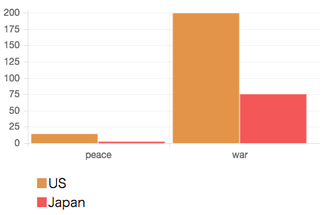

### 目次

* [はじめよう！](#gettingStarted)
* [インストール](#install)
* [練習用コーパスの入手](#getCorpora)
* [NLPツールとしての利用](#useNLP)
* [インデックスブラウザを使う](#indexBrowser)
* [Solrユーザの皆様](#dearSolrUsers)
* [Elasticsearchユーザの皆様](#dearESUsers)
* [Mahoutと連携する](#useWithMahout)
* [Sparkと連携する](#useWithSpark)
* [Luceneを使う](#useLucene)
* [NLP4Lプログラムを開発して実行する](#develop)
* [帰属](#tm)

# はじめよう！{#gettingStarted}

# インストール{#install}

## インストール後のディレクトリ構造

インストール後のディレクトリ構造は以下のようになっています。${nlp4l} は、NLP4L のインストールディレクトリを指しています。

```shell
${nlp4l}/
    bin/
    docs/
    examples/
    lib/
```

# 練習用コーパスの入手{#getCorpora}

NLP4Lを使って自分自身のテキストファイルの分析を始める前に、練習用コーパスを使って動作確認することをお勧めします。いきなり独自のテキストファイルを分析すると、うまく動作させるのに時間がかかったり、分析結果をどのように評価していいか悩んでしまうことがあるかもしれません。

ここで説明する練習用コーパスを使ってインデックスを作成しておくと、これ以降に書かれている解説も実際に試すことができるので理解も容易になるでしょう。

なおここで紹介するコーパスは、livedoorニュースコーパスを除き、研究目的以外での利用が禁止されています。使用に際しては十分ご注意ください。

## NLP4Lの対話型シェル

## インデックスとは？

NLP4Lでは自然言語処理を行うテキストファイルをLuceneの転置インデックスに保存します。転置インデックスは単語をキーにしてその単語を含むドキュメント番号のリストを得られるように整理されたファイル構造です。転置インデックスを本書では単にインデックスと呼ぶことにします。

インデックスはNLP4Lの機能を使ってテキストファイルから新規に作成することもできますし、Apache Solr や Elasticsearch を使って作られた既存のインデックスをNLP4Lの処理対象とすることもできます。ただしその場合は Solr や Elasticsearch が使っている Lucene のバージョンに注意しましょう。あまりに古いバージョンで作成されたインデックスはNLP4LのLuceneライブラリで読めない可能性もあります。

以降では練習用のコーパス（テキストファイル）を入手して新規にインデックスを作る方法を説明します。

## livedoorニュースコーパスの入手とインデックスの作成

次のように実行してロンウイットのサイトから livedoorニュースコーパスをダウンロードして展開します。

```shell
$ mkdir -p ${nlp4l}/corpora/ldcc
$ cd ${nlp4l}/corpora/ldcc
$ wget http://www.rondhuit.com/download/ldcc-20140209.tar.gz
$ tar xvzf ldcc-20140209.tar.gz
```

Windows ユーザーの方は、適宜読み替えて実行してください。

[Note] NLP4L の対話型シェルには、上記手順を実行するコマンド(Unix系OSのみ対応)が用意されています。

```shell
nlp4l> downloadLdcc
Successfully downloaded ldcc-20140209.tar.gz
Try to execute system command: tar xzf /Users/tomoko/repo/NLP4L/corpora/ldcc/ldcc-20140209.tar.gz -C /Users/tomoko/repo/NLP4L/corpora/ldcc
Success.
```

livedoorニュースコーパスは展開するとtextディレクトリの直下に以下のようなカテゴリ名のついたサブディレクトリを持ちます。

```shell
$ ls -l text
total 16
-rw-r--r--    1 koji  staff    223  9 16  2012 CHANGES.txt
-rw-r--r--    1 koji  staff   2182  9 13  2012 README.txt
drwxr-xr-x  873 koji  staff  29682  2  9  2014 dokujo-tsushin
drwxr-xr-x  873 koji  staff  29682  2  9  2014 it-life-hack
drwxr-xr-x  867 koji  staff  29478  2  9  2014 kaden-channel
drwxr-xr-x  514 koji  staff  17476  2  9  2014 livedoor-homme
drwxr-xr-x  873 koji  staff  29682  2  9  2014 movie-enter
drwxr-xr-x  845 koji  staff  28730  2  9  2014 peachy
drwxr-xr-x  873 koji  staff  29682  2  9  2014 smax
drwxr-xr-x  903 koji  staff  30702  2  9  2014 sports-watch
drwxr-xr-x  773 koji  staff  26282  2  9  2014 topic-news
```

さらにそれぞれのサブディレクトリの下に1記事1ファイルに分かれたファイルを持っています。1つの記事ファイルは次のようになっています。

```shell
$ head -n 5 text/sports-watch/sports-watch-6577722.txt
http://news.livedoor.com/article/detail/6577722/
2012-05-21T09:00:00+0900
渦中の香川真司にインタビュー、「ズバリ次のチーム、話を伺いたい」
20日放送、NHK「サンデースポーツ」では、山岸舞彩キャスターが日本代表・香川真司に行ったインタビューの模様を放送した。

```

1行目がlivedoorニュース記事URL、2行目が記事の日付、3行目が記事のタイトル、4行目以降が記事本文です。

では次に、nlp4l コマンドプロンプトから examples/index_ldcc.scala プログラムを実行してlivedoorニュースコーパスをLuceneインデックスに登録します。それには次のようにnlp4lを起動してloadコマンドで examples/index_ldcc.scala プログラムを実行すればOKです。

```shell
$ bin/nlp4l
nlp4l> :load examples/index_ldcc.scala
```

なお、このプログラムでは冒頭で、次のように作成するLuceneインデックスのディレクトリを次のように定義しています。

```scala
val index = "/tmp/index-ldcc"
```

このディレクトリで都合が悪い場合（Windowsを使っているときなど）は別の場所を指すように変更してからloadコマンドで再度プログラムを実行してください。

このプログラムの実行後、Luceneインデックスのディレクトリは次のようになっています。

```shell
$ ls -l /tmp/index-ldcc
total 67432
-rw-r--r--  1 koji  wheel  16359884  2 24 13:40 _1.fdt
-rw-r--r--  1 koji  wheel      4963  2 24 13:40 _1.fdx
-rw-r--r--  1 koji  wheel       520  2 24 13:40 _1.fnm
-rw-r--r--  1 koji  wheel      7505  2 24 13:40 _1.nvd
-rw-r--r--  1 koji  wheel       147  2 24 13:40 _1.nvm
-rw-r--r--  1 koji  wheel       453  2 24 13:40 _1.si
-rw-r--r--  1 koji  wheel  11319391  2 24 13:40 _1.tvd
-rw-r--r--  1 koji  wheel      5636  2 24 13:40 _1.tvx
-rw-r--r--  1 koji  wheel   2169767  2 24 13:40 _1_Lucene50_0.doc
-rw-r--r--  1 koji  wheel   3322315  2 24 13:40 _1_Lucene50_0.pos
-rw-r--r--  1 koji  wheel   1272515  2 24 13:40 _1_Lucene50_0.tim
-rw-r--r--  1 koji  wheel     26263  2 24 13:40 _1_Lucene50_0.tip
-rw-r--r--  1 koji  wheel       136  2 24 13:40 segments_1
-rw-r--r--  1 koji  wheel         0  2 24 13:40 write.lock
```

## 書籍「言語研究のための統計入門」付属CD-ROMデータを使ったインデックスの作成

以下の書籍[1]をお持ちの方は、付属CD-ROMのデータをコーパスとして使えます。この書籍をお持ちでない方は次の節へお進みください。

```shell
[1] 言語研究のための統計入門
石川慎一郎、前田忠彦、山崎誠 編
くろしお出版
ISBN978-4-87424-498-2
```

corpora/CEEAUS 以下に「言語研究のための統計入門」付属CD-ROMのデータの"INDIVIDUAL WRITERS"以下のフォルダー（"INDIVIDUAL WRITERS"は含まない）を、また、"PLAIN"以下のフォルダー（"PLAIN"を含む）をコピーしてください。コピー後、次のようになっていることを確認してください。

```shell
# ディレクトリの作成
$ mkdir -p corpora/CEEAUS

# ここで CD-ROM をコピー

# コピー内容の確認
$ find corpora/CEEAUS -type d
corpora/CEEAUS
corpora/CEEAUS/CEECUS
corpora/CEEAUS/CEEJUS
corpora/CEEAUS/CEENAS
corpora/CEEAUS/CJEJUS
corpora/CEEAUS/PLAIN
```

CEEAUSコーパスは執筆条件が高度に統制されたコーパスとなっているのが特徴です。記事は2種類あり、1つは「大学生のアルバイト」（ファイル名にptjがつくもの）、もう一つは「レストラン全面禁煙」（ファイル名にsmkがつくもの）というテーマについて書かれたものとなっています。CEEAUS以下のサブディレクトリは次のように分かれています。

|サブディレクトリ|内容|
|:----:|:----------------------------|
|CEEJUS|日本人大学生による英作文770本|
|CEECUS|中国人大学生による英作文92本|
|CEENAS|成人英語母語話者による英作文92本|
|CJEJUS|日本人大学生による日本語作文50本|
|PLAIN|上記すべてを含む|

ではCEEAUSコーパスからLuceneインデックスを作成します。最初に上記一覧表のPLAIN以外のコーパスからLuceneインデックスを作成します。

```shell
$ bin/nlp4l
nlp4l> :load examples/index_ceeaus.scala
```

次にPLAINからLuceneインデックスを作成します。

```shell
$ bin/nlp4l
nlp4l> :load examples/index_ceeaus_all.scala
```

それぞれのプログラムの冒頭を見ていただければわかりますが、Luceneインデックスはそれぞれ、/tmp/index-ceeausと/tmp/index-ceeaus-allに作られます。前の例と同じように、別のディレクトリに作成したいときは、書き換えて再度プログラムを実行してください。

## ブラウンコーパスの入手とインデックスの作成

corpora/brown 以下に次のようにしてブラウンコーパスをダウンロードし、展開します。

```shell
$ mkdir ${nlp4l}/corpora/brown
$ cd ${nlp4l}/corpora/brown
$ wget https://ia600503.us.archive.org/21/items/BrownCorpus/brown.zip
$ unzip brown.zip
```

Windows ユーザーの方は、適宜読み替えて実行してください。

[Note] NLP4L の対話型シェルには、上記手順を実行するコマンド(Unix系OSのみ対応)が用意されています。

```shell
nlp4l> downloadBrown
Successfully downloaded brown.zip
Try to execute system command: unzip -o /Users/tomoko/repo/NLP4L/corpora/brown/brown.zip -d /Users/tomoko/repo/NLP4L/corpora/brown
Success.
```

次に、nlp4l プロンプトからLuceneインデックスを作成します。

```shell
$ bin/nlp4l
nlp4l> :load examples/index_brown.scala
```

プログラムの冒頭を見ていただければわかりますが、Luceneインデックスは/tmp/index-brownに作られます。前の例と同じように、別のディレクトリに作成したいときは、書き換えて再度プログラムを実行してください。

## ロイターコーパスの入手とインデックスの作成

ロイターコーパスはアメリカ国立標準技術研究所（NIST）に[申し込む](http://trec.nist.gov/data/reuters/reuters.html)ことで入手できます。ここでは同サイトに紹介されている[David D. Lewis博士のサイト](http://www.daviddlewis.com/resources/testcollections/rcv1/)からダウンロードできるアーカイブを使ってインデックスを作成する方法を参考までにご紹介します。

corpora/reuters 以下に次のようにしてロイターコーパスをダウンロードし、展開します。

```shell
$ mkdir ${nlp4l}/corpora/reuters
$ cd ${nlp4l}/corpora/reuters
$ wget http://www.daviddlewis.com/resources/testcollections/reuters21578/reuters21578.tar.gz
$ tar xvzf reuters21578.tar.gz
```

Windows ユーザーの方は、適宜読み替えて実行してください。

[Note] NLP4L の対話型シェルには、上記手順を実行するコマンド(Unix系OSのみ対応)が用意されています。

```shell
nlp4l> downloadReuters
Successfully downloaded reuters21578.tar.gz
Try to execute system command: tar xzf /Users/tomoko/repo/NLP4L/corpora/reuters/reuters21578.tar.gz -C /Users/tomoko/repo/NLP4L/corpora/reuters
Success.
```

次に、nlp4l プロンプトからLuceneインデックスを作成します。

```shell
$ bin/nlp4l
nlp4l> :load examples/index_reuters.scala
```

これまで同様プログラムを見れば、Luceneインデックスは/tmp/index-reutersに作られることがわかります。前の例と同じように、別のディレクトリに作成したいときは、書き換えて再度プログラムを実行してください。

## NLP4L のスキーマについて

Luceneのインデックスは基本的にスキーマレスですが、NLP4Lではスキーマを設定できます。ここで練習用コーパスのうち、livedoorニュースコーパス（ldcc）、CEEAUS、ブラウンコーパス（brown）で定義されているスキーマを概観しましょう。

以下の表は各コーパスが持つフィールド名を示しています（コーパスで有効なフィールド名にチェック（x）が入っています）。

|フィールド名|ldcc|CEEAUS|brown|
|:----------:|:--:|:----:|:---:|
|file        |    |  x   |  x  |
|type        |    |  x   |     |
|cat         | x  |  x   |  x  |
|url         | x  |      |     |
|date        | x  |      |     |
|title       | x  |      |     |
|body        | x  |      |  x  |
|body_en     |    |  x   |     |
|body_ws     |    |  x   |     |
|body_ja     |    |  x   |     |
|body_pos    |    |      |  x  |

このうち、titleフィールド以下はLuceneのAnalyzerによってコーパスの登録時に文章が単語単位に分割されます。LuceneのAnalyzerは非常に高機能であり、分割だけでなくストップワードの除去、ステミング、各種文字変換などの正規化も行います。どのように分割／正規化されるかは後述します。

それ以外のフィールドは、登録時に単語分割が行われず、コーパスの文字列がそのまま登録されます。特にcatフィールドには文書カテゴリが記録されているため、文書分類タスクなどに利用することができます。

### ldcc のスキーマ

title にはニュース記事のタイトルが、body には記事本文か格納されています。2つのフィールドとも、Lucene の JapaneseAnalyzer によって単語分割が行われます。

### CEEAUS のスキーマ

type には CEEJUS/CEECUS/CEENAS/CJEJUS の区別が、cat には ptj（大学生のアルバイト）/smk（レストラン全面禁煙）のカテゴリが入れられています。body_en と body_ws には同じ英文が格納されていますが、body_en は Lucene の StandardAnalyzer が、body_ws には Lucene の WhitespaceAnalyzer が適用されています。これらのフィールドの使い分けですが、後述の仮説検定ではbody_enを、相関分析ではbody_wsを使っています。body_ja はサブコーパス CJEJUS の日本語文章が格納されています。このフィールドには Lucene の JapaneseAnalyzer が適用されています。

### brown のスキーマ

ブラウンコーパスの記事は次のように品詞タグが各単語ごとについています。

```shell
The/at Fulton/np-tl County/nn-tl Grand/jj-tl Jury/nn-tl said/vbd Friday/nr an/at investigation/nn of/in Atlanta's/np$ recent/jj primary/nn election/nn produced/vbd ``/`` no/at evidence/nn ''/'' that/cs any/dti irregularities/nns took/vbd place/nn ./.
```

この文章がそのまま格納されているのが body_pos フィールドで、同じ内容だが品詞タグが取り除かれているのが body フィールドとなっています。

# NLPツールとしての利用{#useNLP}

NLP4L を NLP ツールとして使う方法を紹介します。前述のLuceneインデックスに登録した練習用コーパスを使いますので、あらかじめ用意しておくとよいでしょう。

## 単語の数を数える

コーパス中に出現する単語の数を数えるのは NLP 処理の基本です。NLP4L はコーパスをLuceneのインデックスに登録してから処理を行いますが、検索エンジン（Lucene）では単語をキーにした転置インデックスというものを持っているので、単語の数を数える処理は大変得意としています。

ここではロイターコーパスを使って単語出現頻度を調べる方法を説明します。準備として次のプログラムをコピー＆ペーストでnlp4lプロンプトに貼り付けて実行してください。なお、コピー＆ペースト操作がしやすいように、複数行のプログラムでは nlp4l プロンプト表示を省略しています。

```scala
// (1)
import org.nlp4l.core._
import org.nlp4l.core.analysis._
import org.nlp4l.stats.WordCounts

// (2)
val index = "/tmp/index-reuters"

// (3)
val reader = RawReader(index)
```

(1)で必要なScalaプログラムのパッケージをインポートしています。このうち、単語の出現頻度はWordCountsオブジェクトを使います。(2)でロイターコーパスのLuceneインデックスディレクトリを指定しています。(3)でRawReaderに使用するLuceneインデックスディレクトリを指定してreaderを取得しています。RawReaderというのはNLP4Lでは比較的低レベルのReaderとなります。別にスキーマを管理する高レベルのIReaderというReaderもありますが、スキーマを渡す手間を省くため、ここではあえてRawReaderを使っています。

取得したreaderを通じて以下で単語の出現頻度を数えていきます。なお、Luceneはフィールドごとに独立した転置インデックスを持っているため、単語数をカウントするなどの処理に際してはフィールド名を指定する必要があります。以下ではロイターの記事本文を登録しているbodyフィールドを指定することにします。

### のべ語数と異なり語数

最初はのべ語数です。Luceneにはもともとあるフィールドののべ語数を返す機能があるので、そのScalaラッパーであるsumTotalTermFreq()関数を使えば簡単に調べられます。

```shell
nlp4l> val total = reader.sumTotalTermFreq("body")
total: Long = 1899819
```

次は異なり語数です。異なり語数とは、単語の種類数です。転置インデックスは異なり語をキーとする構造を持っているので転置インデックスのサイズが異なり語数となります。当然Luceneでは簡単に調べることができ、そのScalaラッパーは次のようになります。

```shell
nlp4l> val count = reader.terms("body").get.size
count: Int = 64625
```

### 単語ごとに数える

今度はもう少し細かく、単語ごとに数えてみましょう。WordCountsオブジェクトのcount()関数を使えば単語ごとに数えることができます。しかし、count()関数はいくつかの引数をとるため、少し準備が必要です。以下にプログラムを示します（nlp4lのプロンプトにコピー＆ペースとして実行できます）。

```scala
// (4)
val allDS = reader.universalset()

// (5)
val analyzer = Analyzer(new org.apache.lucene.analysis.standard.StandardAnalyzer(null.asInstanceOf[org.apache.lucene.analysis.util.CharArraySet]))

// (6)
val allMap = WordCounts.count(reader, "body", Set.empty, allDS, -1, analyzer)
```

(4)ではcount()関数で使うカウント対象となるLuceneの文書番号を取得しています。ここでは全文書を対象にするので、文書の全体集合を取得するuniversalset()関数を使っています。(5)ではLuceneの標準的なAnalyzerであるStandardAnalyzerを指定してScalaのAnalyzerを作成しています。StandardAnalyzerの引数に指定しているnullは、ストップワードを使用しないということを表しています（nullを指定しないとStandardAnalyzerのデフォルトのストップワードが使われます）。(6)のcount()関数で単語ごとの出現頻度を求めています。引数に指定しているSet.emptyは、「すべての単語」を対象にカウントを求めることを指定しています。-1の部分は出現頻度の多い単語上位N個を取得したいときにそのNを指定します。-1はすべての単語を対象に調べる場合に指定します。

結果は表示されましたが、このままだと結果が見にくいので、表示数を絞ってみましょう。たとえばScalaのコレクション関数の機能を使って次のようにすると、"g"で始まる単語を10個選んで単語とその出現数を表示することができます。

```shell
nlp4l> allMap.filter(_._1.startsWith("g")).take(10).foreach(println(_))
(generalize,1)
(gress,1)
(germans,18)
(goiporia,2)
(garcin,2)
(granma,7)
(gorbachev's,10)
(gamble,9)
(grains,110)
(gienow,1)
```

allMapの結果のすべての数を足し合わせてみます（以下のプログラムはWordCountsのtotalCount()関数とやっていることは同じです）。

```shell
nlp4l> allMap.values.sum
res2: Long = 1899819
```

これは最初に調べたのべ語数と確かに一致していることがわかります。また、allMapの大きさは異なり語数と一致しているはずです。やってみましょう。

```shell
nlp4l> allMap.size
res3: Int = 64625
```

こちらも一致しました。

上のcount()ではSet.emptyを渡して全単語を対象に出現頻度をカウントしていましたが、Set.emptyの代わりに特定の単語集合を与えることで、その単語集合だけを対象にカウントできます（特定の単語の数だけを数えたいこともNLPではよくあります）。やってみましょう。

```scala
val whWords = Set("when", "where", "who", "what", "which", "why")
val whMap = WordCounts.count(reader, "body", whWords, allDS, -1, analyzer)
whMap.foreach(println(_))
```

結果は次のようになります。

```shell
nlp4l> whMap.foreach(println(_))
(why,125)
(what,850)
(who,1618)
(which,7556)
(where,507)
(when,1986)
```

### カテゴリごとに数える

では次に単語出現頻度をカテゴリごとに区別して求める方法を見てみましょう。たとえばNLPタスクのひとつ、文書分類ではカテゴリに分類するにあたってその学習データとしてカテゴリごとの単語出現頻度を使うことがあります。そのようなときに使えるテクニックです。

ここの例ではロイターコーパスを使っていますが、placesフィールドをカテゴリの代わりに使ってみたいと思います。そのためにはまず、placesフィールドに入っている単語を次のようにして調べます。

```scala
// (7)
reader.terms("places").get.map(_.text)

// (8) 整形して表示したい場合
reader.terms("places").get.map(_.text).foreach(println(_))
```

(7)または(8)を実行すると、placesフィールドに登録されているすべての単語一覧が表示されます。ここではusaとjapanに注目しましょう。(9)のように実行してそれぞれの文書部分集合を取得します。

```scala
// (9)
val usDS = reader.subset(TermFilter("places", "usa"))
val jpDS = reader.subset(TermFilter("places", "japan"))
```

最後にcount()関数に(9)で求めたそれぞれの部分集合を渡してusaのカウントとjapanのカウントを求めますが、ここでは簡単にwarとpeaceの2語だけのカウントを求めることにします(10)。

```shell
// (10)
nlp4l> WordCounts.count(reader, "body", Set("war", "peace"), usDS, -1, analyzer)
res22: Map[String,Long] = Map(war -> 199, peace -> 14)

nlp4l> WordCounts.count(reader, "body", Set("war", "peace"), jpDS, -1, analyzer)
res23: Map[String,Long] = Map(war -> 75, peace -> 2)
```

これでwarとpeaceの2語に対する、placesがusaの場合とjapanの場合でのカウントがそれぞれ求めることができました。めでたしめでたし・・・としていいでしょうか。

実はplacesフィールドは、地名が複数入っている可能性があります。つまり、usaとjapanの記事が重なっている可能性があります。確かめてみましょう。usDSとjpDSはScalaのSetコレクションオブジェクトですから、&演算子（関数）を使って両者の積集合を簡単に求めることができます。

```shell
nlp4l> (usDS & jpDS).size
res24: Int = 452
```

sizeを使って積集合の大きさを求めています。たしかに重複があるようです。この場合、(11)(12)のように、ScalaのSetの演算子（関数）の&\~を使って集合の差を使えば、重複のない部分に関して単語出現頻度を求めることができます（ただしそのままだとSortedSetには&\~演算子（関数）がないので、toSetを使ってSetに変換しています）。

```shell
nlp4l> // (11) placesにusaの値を持つがjapanの値を持たない記事を対象とする
nlp4l> WordCounts.count(reader, "body", Set("war", "peace"), usDS.toSet &~ jpDS.toSet, -1, analyzer)
res25: Map[String,Long] = Map(war -> 140, peace -> 13)

nlp4l> // (12) placesにjapanの値を持つがusaの値を持たない記事を対象とする
nlp4l> WordCounts.count(reader, "body", Set("war", "peace"), jpDS.toSet &~ usDS.toSet, -1, analyzer)
res26: Map[String,Long] = Map(war -> 16, peace -> 1)
```

### 単語カウントの視覚化（experimental）

これまでいくつかの視点で単語の数を数えてきました。では最後に、単語カウントデータを視覚化してみましょう。Excelなどを使えば視覚化できますが、NLP4Lでは試験的に簡単なチャート表示ツールを提供していますのでここではそれを使います。チャート表示ツールは現在 experimental です。改善のため将来は機能や使い方が変わる可能性があります。

前述の単語カウント結果をあらためて実行し、変数に代入します。

```scala
val usMap = WordCounts.count(reader, "body", Set("war", "peace"), usDS, -1, analyzer)
val jpMap = WordCounts.count(reader, "body", Set("war", "peace"), jpDS, -1, analyzer)
```

次に、チャート表示のためのパッケージをインポートし(11)、チャート表示のプレゼンテーションを取得します(12)。その際、上で取得したデータモデルをプレゼンテーションに渡しています。プレゼンテーションにデータモデルを渡す際は、凡例表示のためのラベルも必要です。

```scala
// (11)
import org.nlp4l.gui._

// (12)
val presentation = BarChart(List(("US",usMap), ("Japan",jpMap)))

// (13)
val server = new SimpleHttpServer(presentation)
server.service
```

チャート表示はWebサーバから配信されますので、(13)のようにプレゼンテーションを引数にして簡易Webサーバを作成して起動します。起動すると、次のメッセージがコンソールに表示されます。

```shell
nlp4l> server.service
WARNING: This function is experimental and might change in incompatible ways in the future release.

To see the chart, access this URL -> http://localhost:6574/chart
To shutdown the server, access this URL -> http://localhost:6574/shutdown
```

表示されている[URL](http://localhost:6574/chart)にモダンなWebブラウザからアクセスすると、棒グラフが表示されます。簡易Webサーバを停止するには、[http://localhost:6574/shutdown](http://localhost:6574/shutdown)にアクセスします。



以上のチャート表示のコードは examples/chart_experimental.scala として1つのスクリプトにまとめてあります。

## ジップの法則を確認する

## 仮説検定

先行研究では非母語話者の書いた英語にはIやyouが多用されがちで、書き手・読み手の可視性が母語話者以上に顕著であるとされます（[1]の3章、[2]）。

```shell
[2] Petch-Tyson, S. (1998). Writer/reader visibility in EFL written discourse. In S. Granger (Ed.), Learner English on Computer (pp. 107-118). London, UK: Longman.
```

そこでここではCEEAUSのデータを使って、日本人英語学習者は英作文で1、2人称代名詞を過剰使用していないことを帰無仮説としてα=.05でカイ2乗検定を行ってみましょう。インデックスデータとしては/tmp/index-ceeaus-allを使いますので、前述のプログラム examples/index_ceeaus_all.scala をあらかじめ実行してインデックスを作成しておきます。次に同じくnlp4lプロンプトから examples/chisquare_test_ceeaus.scala を実行します。

```shell
nlp4l> :load examples/chisquare_test_ceeaus.scala
```

実行すると、次のような一覧が表示されます（カイ2乗統計量が[1]の3章の結果と微妙に異なりますが、単語数が違っているためです。どのようなトークナイザを使用したかによって単語数は異なってきます）。

```Shell
		CEEJUS	CEENAS	chi square
==============================================
       i         4,367     384   324.8068
      my           526     101     1.4384
      me           230      28     8.5172
     you           802      73    55.1096
    your           160      24     2.7664
```

2種類のカテゴリについて検定を多重に繰り返すため、ボンフェローニ補正を行いαb=.025を用います。統計の参考書に付録としてついているカイ2乗分布表を見ると、自由度=1、αb=.025の限界値は5.02389ですから、この値を超えるi、me、youの語については帰無仮説が棄却され、日本人英語学習者はこれらの語を英語母語話者に比べて過剰使用している（有意差がある）といえることがわかりました（書籍[1]の結果と同じです）。

では仮説検定を行うプログラムを順に見てみましょう。

```scala
// (1)
val index = "/tmp/index-ceeaus-all"

// (2)
val schema = SchemaLoader.load("examples/schema/ceeaus.conf")

// (3)
val reader = IReader(index, schema())
```

(1)でLuceneのインデックスを指定しています。(2)はLuceneインデックスのスキーマを設定しています。(3)は(1)(2)で設定したインデックスとスキーマ情報を渡し、IReaderオブジェクトを作成して定数readerに代入しています。readerを通じてインデックス（コーパス）にアクセスできます。

次の行からは早速そのreaderを使ってインデックスのサブセットを取得しています。

```scala
// (4)
val docSetJUS = reader.subset(TermFilter("file", "ceejus_all.txt"))
val docSetNAS = reader.subset(TermFilter("file", "ceenas_all.txt"))
```

インデックスのサブセットを取得するには、IReaderのsubset()関数にFilterを渡して行います。ここではFilterとしてTermFilterを使っています。TermFilterは2つの引数を取り、最初の引数でLuceneインデックスのフィールド名を指定し、2つめの引数でそのフィールド値を指定します。このようにすることで、Luceneインデックスの中から該当するフィールド値を持つ文書セットだけを指定できます。(4)の1行目はファイル名がceejus_all.txtとなっているものを指定しているので、日本人英語学習者の英作文だけを取り出しています。2行目はファイル名がceenas_all.txtとなっているものを指定しているので、英語母語話者の英作文を対象にしています。

次にWordCountsオブジェクトのtotalCount()関数を使ってbody_enフィールド中の全単語数を数えています。

```scala
// (5)
val totalCountJUS = WordCounts.totalCount(reader, "body_en", docSetJUS)
val totalCountNAS = WordCounts.totalCount(reader, "body_en", docSetNAS)
```

このとき、(4)で取得した文書セットを第3引数で渡すことで、それぞれ日本人英語学習者と英語母語話者のカウントを分けて取得するようにしています。

次にwordsに今回注目する単語のリストを保持します。

```scala
// (6)
val words = List("i", "my", "me", "you", "your")
```

次にその注目する単語について、count()関数を使って日本人英語学習者と英語母語話者それぞれの単語数を単語ごとに数えます（単語別のカウントがMap[String,Long]で得られます）。

```scala
// (7)
val wcJUS = WordCounts.count(reader, "body_en", words.toSet, docSetJUS)
val wcNAS = WordCounts.count(reader, "body_en", words.toSet, docSetNAS)
```

最後にStatsオブジェクトのchiSquare()関数を使ってカイ2乗統計量を求めています。

```scala
// (8)
println("\t\tCEEJUS\tCEENAS\tchi square")
println("==============================================")
words.foreach{ w =>
  val countJUS = wcJUS.getOrElse(w, 0.toLong)
  val countNAS = wcNAS.getOrElse(w, 0.toLong)
  val cs = Stats.chiSquare(countJUS, totalCountJUS - countJUS, countNAS, totalCountNAS - countNAS, true)
  println("%8s\t%,6d\t%,6d\t%9.4f".format(w, countJUS, countNAS, cs))
}

// (9)
reader.close
```

chiSquare()関数の第1、3引数にはそれぞれの単語のカウント数を、第2、4引数にはそれ以外の単語のカウント数を渡します。また、第5引数にはイェーツ補正を行う（true）か否か（false）を指定します。

プログラムの最後にIReaderをclose()します(9)。

同じように、ブラウンコーパスを使って特定の単語の使用頻度に有意差があるかどうかを見てみましょう。書籍[3]2.1.3には法助動詞couldとwillの使用頻度が、前者はromanceカテゴリにおいて高く、後者はnewsカテゴリにおいて高いという結果が示されています。[NLTK web](http://www.nltk.org/book/ch02.html)

```shell
[3] Natural Language Processing with Python
Steven Bird, Ewan Klein, Edward Loper
O'Reilly

入門自然言語処理
萩原正人、中山敬広、水野貴明
オライリー・ジャパン
```

ここではもう少し突っ込んで仮説検定を行い、この使用頻度に有意差があるか計算します。同様にαb=.025を用います。実行結果は次のようになります。

```shell
nlp4l> :load examples/chisquare_test_brown.scala
       	     romance	news	chi square
==============================================
   could         195      87     101.2919
    will          49     390     148.4053
```

どちらも自由度=1、αb=.025の限界値5.02389を超えているので有意差があるといえます。プログラムは前掲のものとほとんど同じなので解説は省略します。

## 相関分析

接続副詞は文内要素の論理的な結束性を担う重要な役割を果たしています（[1]の4章）。ここではCEEAUSのCEEJUS（日本人英語学習者）、CEECUS（中国人英語学習者）、CEENAS（英語母語話者）のサブコーパス間で接続副詞の使用頻度を比較し、どの程度の関係性が存在するのか見てみましょう。仮にどのような書き手であっても接続表現の使用パターンが安定しているのであれば、書き手間に高い相関関係が見えるでしょうし、逆に母語話者かどうかで使用頻度が変わるのであれば、相関係数は低くなるでしょう。

では早速プログラムを実行してみます。同じくインデックスデータとしては/tmp/index-ceeaus-allを使いますので、前述のプログラム examples/index_ceeaus_all.scala をあらかじめ実行してインデックスを作成しておきます。次にnlp4lプロンプトから examples/correlation_analysis_ceeaus.scala を実行します。

```shell
nlp4l> :load examples/correlation_analysis_ceeaus.scala
```

実行すると2つの表が表示されます。1つめの表は次の通りです。

```shell
word counts
========================================
    word    CEEJUS    CEECUS    CEENAS
  besides,      21         5         2
nevertheless,    2         1         1
     also,      18         5         8
 moreover,      68         8         4
  however,     165        18        33
therefore,      86         7        13
       so,     242         9         5
```

wordの列にある単語が接続副詞です。各接続副詞の後ろにはカンマ（","）がついていますが、これは他の一般副詞と区別するため、接続副詞をコーパスから検索する際に後ろにカンマを伴っている単語を探すところから来ています。数字は各サブコーパスにおける出現頻度を示しています。ただし出現頻度を単純に比較するだけでは各サブコーパス間で相関性があるのかはわかりません。そこで2つめの表を見てみます。

```shell
Correlation Coefficient
================================
	CEEJUS	CEECUS	CEENAS
CEEJUS	1.000	0.690	0.433
CEECUS	0.690	1.000	0.886
CEENAS	0.433	0.886	1.000
```

2つめの表は単相関行列表を示しています。この結果から、日本人英語学習者と英語母語話者は中程度の正の相関が認められ（r=.43）、中国人英語学習者と英語母語話者は強い正の相関が認められる（r=.89）ことがわかりました。また日本人英語学習者と中国人英語学習者は中程度の正の相関があります（r=.69）。ただしこのうち相関係数が有意となったものは中国人英語学習者と英語母語話者の相関のみです（[1]の4章）。

では相関分析を行うプログラム examples/correlation_analysis_ceeaus.scala を順に見てみましょう。プログラムの最初の部分（インデックスの指定、スキーマの設定、IReader オブジェクトの作成）は前述の仮説検定で説明した(1)から(3)と同じなので省略します。

プログラムの次の部分(4)はやはり仮説検定のところでも使ったテクニックで、インデックスから各サブコーパスを対象に処理ができるように指定をしています。ここでは指定するサブコーパスに CEECUS を追加しています。

```scala
// (4)
val docSetJUS = reader.subset(TermFilter("file", "ceejus_all.txt"))
val docSetCUS = reader.subset(TermFilter("file", "ceecus_all.txt"))
val docSetNAS = reader.subset(TermFilter("file", "ceenas_all.txt"))
```

次にwordsに今回注目する単語のリストを保持します(5)。

```scala
// (5)
val words = List("besides,", "nevertheless,", "also,", "moreover,", "however,", "therefore,", "so,")
```

各単語には一般副詞と区別するために後ろにカンマをつけています。このリストを次のWordCountsのcount()関数に指定することでこれらの単語だけに注目してそれぞれのコーパスから単語の出現頻度を取得します。

```scala
// (6)
val wcJUS = WordCounts.count(reader, "body_ws", words.toSet, docSetJUS)
val wcCUS = WordCounts.count(reader, "body_ws", words.toSet, docSetCUS)
val wcNAS = WordCounts.count(reader, "body_ws", words.toSet, docSetNAS)
```

ここで注目していただきたいのが対象フィールドにbody_wsを指定している点です。前述の仮説検定ではbody_enフィールドを対象にしていました。

スキーマ設定ファイル examples/schema/ceeaus.confを見ると、body_enはLuceneのStandardAnalyzerを使って作成した(7)を、body_wsはLuceneのWhitespaceTokenizerにLowerCaseFilterを組み合わせて作成した(8)を使って単語分割されています。

```json
schema {
  defAnalyzer {
    class : org.apache.lucene.analysis.standard.StandardAnalyzer
  }
  fields　= [
    {
      name : file
      indexed : true
      stored : true
    }
    {
      name : type
      indexed : true
      stored : true
    }
    {
      name : cat
      indexed : true
      stored : true
    }
    {
      name : body_en  // (7)
      analyzer : {
        tokenizer {
          factory : standard
        }
        filters = [
          {
            factory : lowercase
          }
        ]
      }
      indexed : true
      stored : true
      termVector : true
      positions : true
    }
    {
      name : body_ws  // (8)
      analyzer : {
        tokenizer {
          factory : whitespace
        }
        filters = [
          {
            factory : lowercase
          }
        ]
      }
      indexed : true
      stored : true
      termVector : true
      positions : true
    }
    {
      name : body_ja
      analyzer : {
        class : org.apache.lucene.analysis.ja.JapaneseAnalyzer
      }
      indexed : true
      stored : true
      termVector : true
      positions : true
    }
  ]
}
```

body_wsとbody_enの単語分割の違いを見てみましょう。examples/correlation_analysis_ceeaus.scala プログラムを実行した状態の nlp4l のプロンプトから次のようにしてスキーマのそれぞれのフィールドから Analyzer を取得します。

```shell
nlp4l> val analyzerWs = schema.getAnalyzer("body_ws").get
nlp4l> val analyzerEn = schema.getAnalyzer("body_en").get
```

次にbody_wsフィールドに設定されているanalyzerWsを使って"Also, when we enter college, we are no longer children"という文を単語分割します。

```shell
nlp4l> analyzerWs.tokens("Also, when we enter college, we are no longer children")
res19: org.nlp4l.core.analysis.Tokens = Tokens(Map(startOffset -> 0, type -> word, positionIncrement -> 1, endOffset -> 5, term -> also,, positionLength -> 1, bytes -> [61 6c 73 6f 2c]), Map(startOffset -> 6, type -> word, positionIncrement -> 1, endOffset -> 10, term -> when, positionLength -> 1, bytes -> [77 68 65 6e]), Map(startOffset -> 11, type -> word, positionIncrement -> 1, endOffset -> 13, term -> we, positionLength -> 1, bytes -> [77 65]), Map(startOffset -> 14, type -> word, positionIncrement -> 1, endOffset -> 19, term -> enter, positionLength -> 1, bytes -> [65 6e 74 65 72]), Map(startOffset -> 20, type -> word, positionIncrement -> 1, endOffset -> 28, term -> college,, positionLength -> 1, bytes -> [63 6f 6c 6c 65 67 65 2c]), Map(startOffset -> 29, type -> word, positionIn...
```

LuceneのAnalyzerは単語分割する際に分割された単語文字列だけでなく、文章内の単語の位置情報や種類など、非常に多くの情報を付加してくれます。そのためこのままだと表示が見にくいので、次のように少し工夫します（Analyzerの使い方は本書で後述します）。

```shell
nlp4l> analyzerWs.tokens("Also, when we enter college, we are no longer children.").map(_.get("term").get).foreach(println(_))
also,
when
we
enter
college,
we
are
no
longer
children.
```

同様に、analyzerEnを使って同じ文章を単語分割してみます。

```shell
nlp4l> analyzerEn.tokens("Also, when we enter college, we are no longer children.").map(_.get("term").get).foreach(println(_))
also
when
we
enter
college
we
are
no
longer
children
```

これらの結果から、analyzerWsを使っているbody_wsフィールドでは単語の後ろについているカンマやピリオドを取り除かないが、analyzerEnを使っているbody_enフィールドでは単語の後ろについているこれらの記号を取り除いていることがわかります。

したがって、"also,"という接続副詞としてのalsoのみを検索したい今回はbody_enではなくbody_wsを処理対象にしています。

ではプログラムに戻りましょう。次の部分(9)では1つめの表である単語出現頻度を表示しています。

```scala
// (9)
println("\n\n\nword counts")
println("========================================")
println("\tword\tCEEJUS\tCEECUS\tCEENAS")
words.foreach{ e =>
  println("%10s\t%,6d\t%,6d\t%,6d".format(e, wcJUS.getOrElse(e, 0), wcCUS.getOrElse(e, 0), wcNAS.getOrElse(e, 0)))
}
```

プログラムの最後の部分(10)では単相関行列表を表示しています。行列表なので、2重ループのプログラムになっています。

```scala
// (10)
val lj = List( ("CEEJJS", wcJUS), ("CEECUS", wcCUS), ("CEENAS", wcNAS) )
println("\n\n\nCorrelation Coefficient")
println("================================")
println("\tCEEJUS\tCEECUS\tCEENAS")
lj.foreach{ ej =>
  print("%s".format(ej._1))
  lj.foreach{ ei =>
    print("\t%5.3f".format(Stats.correlationCoefficient(words.map(ej._2.getOrElse(_, 0.toLong)), words.map(ei._2.getOrElse(_, 0.toLong)))))
  }
  println
}

// (11)
reader.close
```

相関係数を計算するためにStatsオブジェクトのcorrelationCoefficient()関数を使って求めています。correlationCoefficient()関数には相関を求めたい2つの単語の頻度ベクトルを渡します。

プログラムの最後にreaderをcloseしています(11)。

同じように、ブラウンコーパスを使ってカテゴリ間の相関分析を行ってみます。書籍[3]2.1.3に紹介されている法助動詞（"can", "could", "may", "might", "must", "will"）について調べます。プログラム examples/correlation_analysis_brown.scala を実行すると、同様に単語頻度表、単相関行列表が表示されます。

```shell
nlp4l> :load examples/correlation_analysis_brown.scala

word counts
========================================
word       gov  news  romance  SF
     can   119    94       79  16
   could    38    87      195  49
     may   179    93       11   4
   might    13    38       51  12
    must   102    53       46   8
    will   244   390       49  17


Correlation Coefficient
================================
            gov   news  romance  SF
gov        1.000  0.789 -0.500 -0.385
news       0.789  1.000 -0.127  0.029
romance   -0.500 -0.127  1.000  0.980
SF        -0.385  0.029  0.980  1.000
```

2つめの表より、governmentとnews および romanceとscience_fiction が互いに強い正の相関があることがわかります。プログラムは前掲のものとほぼ同じなので解説は省略します。

# インデックスブラウザを使う{#indexBrowser}

NLP4L の対話型シェルには、CUIのLucene インデックスブラウザが付属しています。インデックスブラウザを使うと、Javaプログラムを書かずに、Luceneインデックス中のフィールドや単語の情報を簡単に閲覧、デバッグができます。

ここでは、前の節で作成した、Livedoorニュースコーパスのインデックスの中をブラウズしてみましょう。

なお、インデックスブラウザのコマンド（メソッド）一覧は、nlp4lのプロンプトに":?"と入力すると見ることができます。

```shell
nlp4l> :?
```

また、":?" のうしろにコマンドをつけると、さらに詳しいヘルプが表示されます。

```shell
nlp4l> :? open
-- method signature --
def open(idxDir: String): RawReader

-- description --
Open Lucene index in the directory. If an index already opened, that is closed before the new index will be opened.

-- arguments --
idxDir       Lucene index directory

-- return value --
Return : index reader

-- usage --
nlp4l> open("/tmp/myindex")
```

## フィールド、単語のブラウジング

open() 関数にインデックスディレクトリのパスを渡すことでインデックスをオープンします。

```shell
nlp4l> open("/tmp/index-ldcc")
Index /tmp/index-ldcc was opened.
res4: org.nlp4l.core.RawReader = IndexReader(path='/tmp/index-ldcc',closed=false)
```

close で、現在オープンしているインデックスをクローズします。

```shell
nlp4l> close
Index /tmp/index-ldcc was closed.
```

status とタイプすると、現在オープンしているインデックスについて、ドキュメント数やフィールドの情報、各フィールドに含まれるユニークな単語数などの概略が表示されます。

```shell
nlp4l> open("/tmp/index-ldcc")
Index /tmp/index-ldcc was opened.
res4: org.nlp4l.core.RawReader = IndexReader(path='/tmp/index-ldcc',closed=false)

nlp4l> status

========================================
Index Path       : /tmp/index-ldcc
Closed           : false
Num of Fields    : 5
Num of Docs      : 7367
Num of Max Docs  : 7367
Has Deletions    : false
========================================
        
Fields Info:
========================================
  # | Name  | Num Terms 
----------------------------------------
  0 | body  |      64543
  1 | url   |       7367
  2 | date  |       6753
  3 | title |      14205
  4 | cat   |          9
========================================
```

さらに、browseTerms() 関数に、フィールド名を渡すと、nextTerms および prevTerms 関数で、フィールド中に含まれる単語の情報を閲覧できるようになります。

nextTerms(), prevTerms() には、スキップするページ数を渡すことができます。また、nextTerms(1) には nt, prevTerms(1) には pt というショートカット関数が定義されています。

title フィールド中に含まれる単語を閲覧してみましょう。単語は辞書順で並んでおり、各行の冒頭がインデックスされている単語、DF はその単語を含むドキュメント数(document frequency)、Total TF (term frequency) はその単語の出現回数の総計を表します。

```shell
nlp4l> browseTerms("title")
Browse terms for field 'title', page size 20
Type "nextTerms(skip)" or "nt" to browse next terms.
Type "prevTerms(skip)" or "pt" to browse prev terms.
Type "topTerms(n)" to find top n frequent terms.

// nt で次のページ
nlp4l> nt
Indexed terms for field 'title'
0 (DF=152, Total TF=176)
000 (DF=13, Total TF=13)
003 (DF=3, Total TF=3)
0048 (DF=1, Total TF=1)
007 (DF=8, Total TF=8)
...

// 何度かページング, または nextTerms(n)でスキップすると、アルファベットから始まる単語が見える
nlp4l> nt
Indexed terms for field 'title'
cocorobo (DF=1, Total TF=1)
code (DF=1, Total TF=1)
coin (DF=1, Total TF=1)
collection (DF=3, Total TF=3)
...

// pt で前のページに戻る
nlp4l> pt
Indexed terms for field 'title'
chat (DF=1, Total TF=1)
check (DF=2, Total TF=2)
chochokure (DF=1, Total TF=1)
christian (DF=1, Total TF=1)
...
```

1ページに表示される単語数はデフォルトで20件ですが、browseTerms("title",100)のように第２引数でページサイズを指定することもできます。

さらに、browseTermDocs() 関数に、フィールド名と単語を渡すと、nextDocs および prevDocs 関数で、指定されたフィールドにその単語を含むドキュメントの情報を閲覧できるようになります。

nextDocs(), prevDocs() には、スキップするページ数を渡すことができます。また、nextDocs(1) には nd, prevDocs(1) には pd というショートカット関数が定義されています。

title フィールドに "iphone" という単語を含むドキュメントを閲覧してみましょう。ドキュメントはLucene内部のドキュメントID順で並んでおり、idはドキュメントID、freq はドキュメント中に指定の単語（ここでは"iphone"）が出現する頻度を表します。

インデックス時に position や offset (その単語がドキュメント中のどこに出現するかの情報。後述) を保存していると、これらの情報もあわせて表示されます。

```shell
nlp4l> browseTermDocs("title", "iphone")
Browse docs for term 'iphone' in field 'title', page size 20
Type "nextDocs(skip)" or "nd" to browse next terms.
Type "prevDocs(skip)" or "pd" to browse prev terms.

// nd で次のページ
nlp4l> nd
Documents for term 'iphone' in field 'title'
Doc(id=49, freq=1, positions=List(pos=5))
Doc(id=270, freq=1, positions=List(pos=0))
Doc(id=648, freq=1, positions=List(pos=0))
Doc(id=653, freq=1, positions=List(pos=2))
Doc(id=778, freq=1, positions=List(pos=2))
Doc(id=780, freq=2, positions=List(pos=0, pos=15))
...

// pd で前のページに戻る
nlp4l> pd
Documents for term 'iphone' in field 'title'
Doc(id=1173, freq=1, positions=List(pos=1))
Doc(id=1176, freq=1, positions=List(pos=0))
Doc(id=1180, freq=1, positions=List(pos=2))
Doc(id=1195, freq=1, positions=List(pos=5))
Doc(id=1200, freq=1, positions=List(pos=11))
Doc(id=1203, freq=1, positions=List(pos=5))
...
```

1ページに表示されるドキュメント数はデフォルトで20件ですが、browseTermDocs("title","iphone",100)のように第３引数でページサイズを指定することもできます。

## ドキュメントの閲覧

より詳しくドキュメントの内容を見たい場合は、showDoc() 関数にドキュメントIDを渡すことでフィールド値を表示させることができます。

前章の browseTermDocs / nd / pd 関数で取得したドキュメントID (ここでは id=1195) に対応するドキュメント内容を表示してみましょう。"iPhone"という単語が、title フィールドに出現することが確認できます。

```shell
nlp4l> showDoc(1195)
Doc #1195
(Field) cat: [it-life-hack]
(Field) url: [http://news.livedoor.com/article/detail/6608703/]
(Field) title: [GoogleドライブのファイルをiPhoneからダイレクトに編集する【知っ得！虎の巻】]
...
```

## Position / Offsets

Position / Offsets はインデックスに付加的に保存できる情報で、各単語のドキュメント中の出現箇所を示します。

たとえば、以下の例のドキュメントID=199のドキュメントに着目すると、

* body フィールドに "北海道" という単語が2回出現する
* 最初の出現は 126 単語め(position=126)で、詳細な文字位置は 247-250
* 2回めの出現は 129 単語め(position=129)で、詳細な文字位置は 255-258

ということがわかります。

```shell
nlp4l> browseTermDocs("body","北海道")
Browse docs for term body in field 北海道, page size 20
Type "nextDocs(skip)" or "nd" to browse next terms.
Type "prevDocs(skip)" or "pd" to browse prev terms.

nlp4l> nd
Documents for term '北海道' in field 'body'
Doc(id=148, freq=1, positions=List((pos=491,offset={997-1000})))
Doc(id=199, freq=2, positions=List((pos=126,offset={247-250}), (pos=129,offset={255-258})))
...
```

## 出現頻度の高い Top N 単語の抽出

browseTerms() でフィールドを指定した後、topTerms() 関数でそのフィールドでドキュメント出現頻度(DF)の高い上位N件の単語とその頻度を取得できます。

```shell
nlp4l> browseTerms("title")
Browse terms for field title, page size 20
Type "nextTerms(skip)" or "nt" to browse next terms.
Type "prevTerms(skip)" or "pt" to browse prev terms.
Type "topTerms(n)" to find top n frequent terms.

nlp4l> topTerms(10)
Top 10 frequent terms for field title
  1: 話題 (DF=587, Total TF=607)
  2: sports (DF=493, Total TF=493)
  3: watch (DF=493, Total TF=493)
  4: 映画 (DF=373, Total TF=402)
  5: 女 (DF=319, Total TF=356)
  6: 1 (DF=318, Total TF=342)
  7: android (DF=307, Total TF=322)
  8: 女子 (DF=301, Total TF=318)
  9: 3 (DF=299, Total TF=323)
 10: アプリ (DF=291, Total TF=337)
```

# Solrユーザの皆様{#dearSolrUsers}

# Elasticsearchユーザの皆様{#dearESUsers}

# Mahoutと連携する{#useWithMahout}

# Sparkと連携する{#useWithSpark}

この節では、事前に Spark 1.3.0 以上がインストールされていることが必要です。(1.3.0 以前の Spark をお使いの場合は、適宜読み替えてください。)

## MLLibと連携する

NLP4L でコーパスの特徴量を抽出し、 Spark MLlib への入力として与えることができます。

### クラスタリング

Spark MLlib にはいくつかのクラスタリングアルゴリズム(k-means, Gaussian mixture 等)が実装されていますが、ここでは LDA (Latent Dirichlet allocation) を利用する例を紹介します。なお、Spark MLlib に実装されているクラスタリングアルゴリズムの詳細は [公式リファレンス (v1.3.0)](http://spark.apache.org/docs/1.3.0/mllib-clustering.html) を参照してください。

注: LDA は Spark 1.3.0 から導入されました。

サンプルプログラム examples/spark_mllib_lda.scala を実行すると、ブラウンコーパスの各ドキュメントを、TFベースの文書ベクトルに変換してファイルに出力します。

```shell
nlp4l> :load examples/spark_mllib_lda.scala
```

実行すると、カレントディレクトリに以下のファイルが出力されます。どのフィールドや単語を特徴量とするかにより、3パターンの特徴ベクトルを出力しています。

words\*.txt には1行1単語が出力されます。すなわち、行数が特徴空間の次元数となります。data\*.txt は1行が1ベクトルを表し、MLlibへの入力ファイルになります。ベクトル中の要素の順番は、words\*.txtと一致しています。

1. body フィールド中の全単語を使って特徴量を抽出するパターン。単語数は 44677 です。

  * words.txt
  * data.txt

2. body_pos_nn フィールド(名詞のみを抜き出したフィールド)中の全単語を使って特徴量を抽出するパターン。単語数は削減されて 13236 になります。

  * words_noun.txt
  * data_noun.txt

3. body_pos_nn フィールドから、比較的少ない文書に出現する単語(IDF値の高い単語)に絞って特徴量を抽出するパターン。単語数はさらに削減されて 4958 となります。

  * words_high_idf.txt
  * data_noun_high_idf.txt

特徴量を抽出したら、Spark でLDAを実行します。spark-shell を起動し、以下のように入力してください。

```shell
$ spark-shell

scala> import org.apache.spark.mllib.clustering.LDA
scala> import org.apache.spark.mllib.linalg.Vectors
// data*.txt を入力として与える
scala> val data = sc.textFile("/path/to/data_noun_high_idf.txt")
scala> val parsedData = data.map(s => Vectors.dense(s.trim.split(' ').map(_.toDouble)))
scala> val corpus = parsedData.zipWithIndex.map(_.swap).cache()
// K=5 を指定してモデルを作成する
scala> val ldaModel = new LDA().setK(5).run(corpus)

// 推定されたトピックを取得する. トピックは各単語の出現確率分布として表現される.
scala> val topics = ldaModel.topicsMatrix
6.582992067532604     0.12712473287343715   2.0749605231892994    ... (5 total)
1.7458039064383513    0.00886714658883468   4.228671695274331     ...
0.993056435220057     4.64132780991838      0.18921245384121668   ...
...

// 各ドキュメントがどのトピックに属するかの確率分布を取得する.
scala> val topics = ldaModel.topicDistributions
scala> topics.take(5).foreach(println)
(384,[0.13084037186524378,0.02145904901484863,0.30073967633170434,0.18175275728283377,0.36520814550536945])
(204,[0.5601036760461913,0.04276689792374281,0.17626863743620377,0.06992184061352519,0.15093894798033694])
(140,[0.01548241660044312,0.8975654153324738,0.013671563672420709,0.061526631681883964,0.011753972712778454])
(466,[0.052798328682649866,0.04602366817727088,0.7138181945792464,0.03541828992076265,0.1519415186400702])
(160,[0.20118704750574637,0.12811775189441738,0.23204896620959134,0.1428791353110324,0.29576709907921245])
```

詳しい Spark MLlib の使い方は Spark の API ドキュメントを参照してください。

# Luceneを使う{#useLucene}

## NLP4Lが提供するLuceneの機能

## Analyzer

## 既存インデックスを検索する

## 簡単ファセット

## Term Vector から TF/IDF 値を求める

## 文書類似度を計算する

## More Like This

## 独自インデックスの作成

### Schemaの定義

#### 数値型

NLP4LをNLPツールとして使う場合、IntやLongなどの数値型のフィールドを意識する必要はないかもしれません。しかし、Luceneはこれらの型をサポートしており、それぞれの型に適した形で値をインデックスに保存しています。ここでは簡単にこれらの型を扱う方法を説明します。

### 文書の登録

## FST を単語辞書として使う

NLP4LはLuceneのFSTを簡単な単語辞書として使えるようにシンプルにラップしたSimpleFSTを提供しています。FSTを単語辞書として使うと、対象文字列の最左部分文字列（左端から始まるすべての接頭辞）が1回の走査で探索できるため、Luceneプロジェクトでは日本語形態素解析器やシノニム検索で利用されています。

SimpleFSTを利用したサンプルプログラム examples/use_fst.scala を以下に示します。

```scala
import org.nlp4l.core._

// (1)
val index = "/tmp/index-brown"
val schema = SchemaLoader.load("examples/schema/brown.conf")
val reader = IReader(index, schema)

// (2)
val fst = SimpleFST()

// (3)
reader.field("body_pos").get.terms.foreach { term =>
  fst.addEntry(term.text, term.totalTermFreq)
}

// (4)
fst.finish

// (5)
val STR = "iaminnewyork"

// (6)
for(pos <- 0 to STR.length - 1){
  fst.leftMostSubstring(STR, pos).foreach { e =>
    print("%s".format("             ".substring(0, pos)))
    println("%s => %d".format(STR.substring(pos, e._1), e._2))
  }
}
```

このプログラムは前述のブラウンコーパスを登録したLuceneインデックスを参照し、ブラウンコーパスで使用されているすべての単語をFSTに登録します。そのため、あらかじめ examples/index_brown.scala を実行しておく必要があります。

(1)でブラウンコーパスが登録されているインデックスをオープンします。(2)でSimpleFSTのインスタンスを取得しています。(3)で、(1)でオープンしたブラウンコーパスのインデックスのbody_posフィールドから単語一覧を取得しながら、SimpleFSTのaddEntry()を使って単語とその出現頻度をSimpleFSTに登録しています。addEntry()の呼び出しは、ソート済みの文字列リストを使って順に呼び出さなければならないことに注意してください。このプログラムではソートらしきことはしていないように見えますが、Luceneインデックスには単語がソート済みの状態で登録されているため、明示的なソートは不要になっています。登録が終了したら、(4)でfinish()を呼んでいます。

(5)以降は、作成したSimpleFSTの単語辞書を使って文字列STR（"I am in New York"という文を小文字にして詰めた文字列です）にどんな単語が含まれているか、辞書引きをしながらパースしています。(6)のforループは文字列STRの走査開始位置を左から1文字ずつずらしています。最左部分文字列を走査するにはSimpleFSTのleftMostSubstring()を使います。第1引数には走査する文字列を、第2引数には捜査開始位置を渡します。戻り値は(Int,Long)のタプルのSeqで返ってきます。タプルは順に部分文字列の終了位置、単語登録時に指定されたLong値（ここでは当該単語の出現頻度）です。ためしに"welcome"という文字列を捜査開始位置0で辞書引きしてみると次のようになります。

```shell
nlp4l> fst.leftMostSubstring("welcome", 0)
res7: Seq[(Int, Long)] = List((1,5), (2,2656), (7,2705))
```

タプルが3つ返ってきました。最初のタプル(1,5)は終了位置が1の単語（つまり単語"w"）が5回、2番目のタプル(2,2656)は終了位置が2の単語（つまり単語"we"）が2656回、3番目のタプル(7,2705)は終了位置が7の単語（つまり単語"welcome"）が2705回ブラウンコーパスに出現したことを意味しています。また、終了位置がこれら以外の単語（"wel","welc","welco","welcom"）は作成した単語辞書にないこともわかります。

さて、最初のサンプルプログラムの実行結果は次のようになります。なんとなくですが、"I am in New York" という単語で区切ったときにそれぞれの単語が頻出していることが読み取れると思います。

```shell
nlp4l> :load examples/use_fst.scala
i => 5164
 a => 23195
 am => 23431
  m => 16
  mi => 18
  min => 22
   i => 5164
   in => 26500
   inn => 26508
    n => 38
     n => 38
     ne => 43
     new => 1677
      e => 40
       w => 5
        y => 5
        york => 306
         o => 26
         or => 4231
          r => 38
           k => 10
```

SimpleFSTにはleftMostSubstring()以外にも、メモリ上に作成した単語辞書をディスクに保存するsave()や、保存した単語辞書を読み込むためのload()という関数もありますので、いろいろ活用してください。

# NLP4Lプログラムを開発して実行する{#develop}

## REPLから実行する

## コンパイルして実行する

# 帰属{#tm}
Apache Lucene, Solr and their logos are trademarks of the Apache Software Foundation.

Elasticsearch is a trademark of Elasticsearch BV, registered in the U.S. and in other countries.
